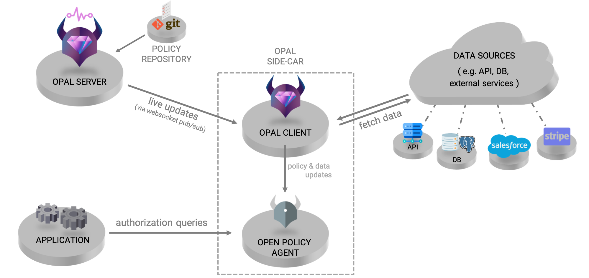
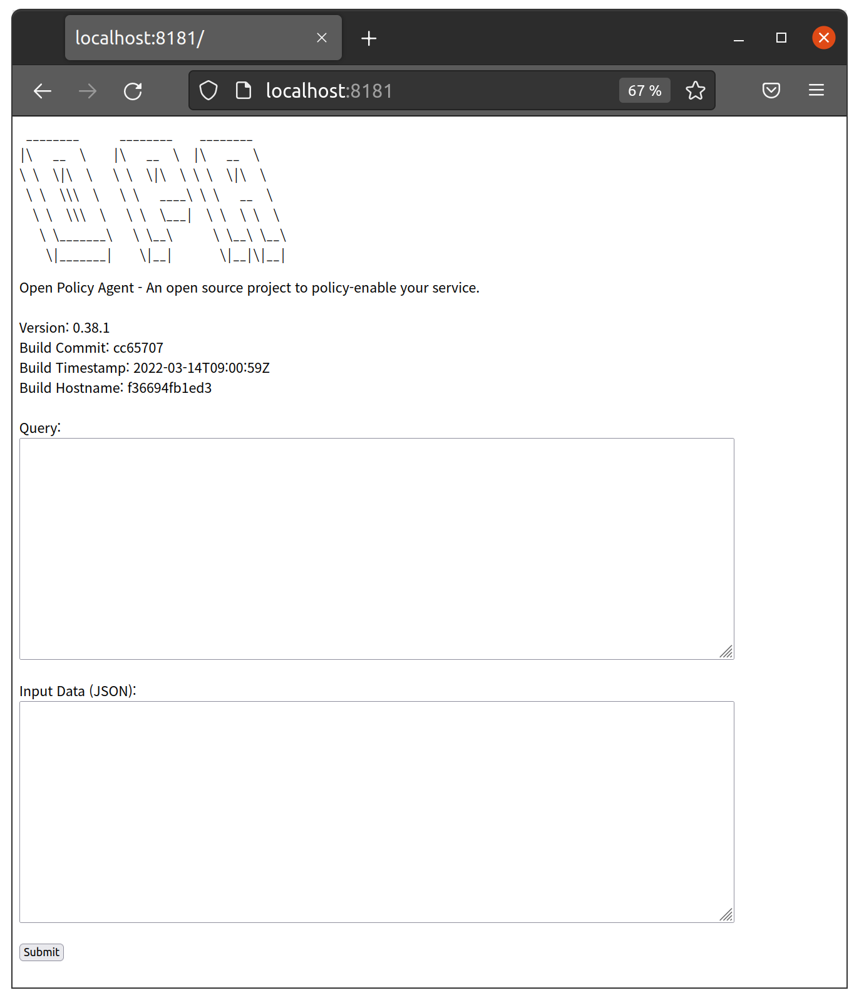
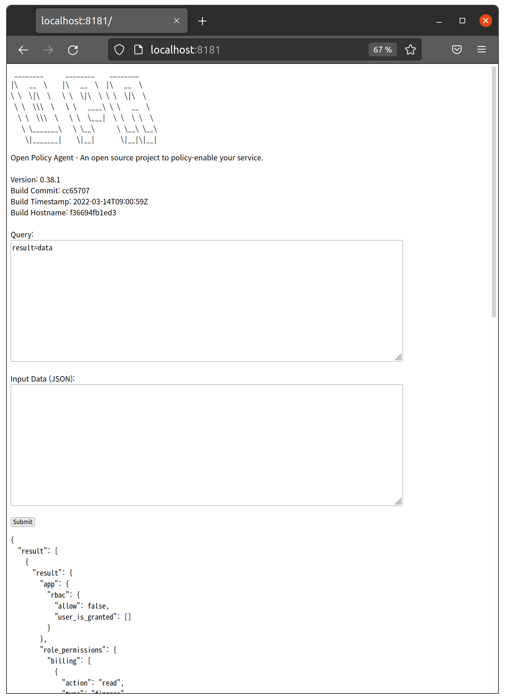
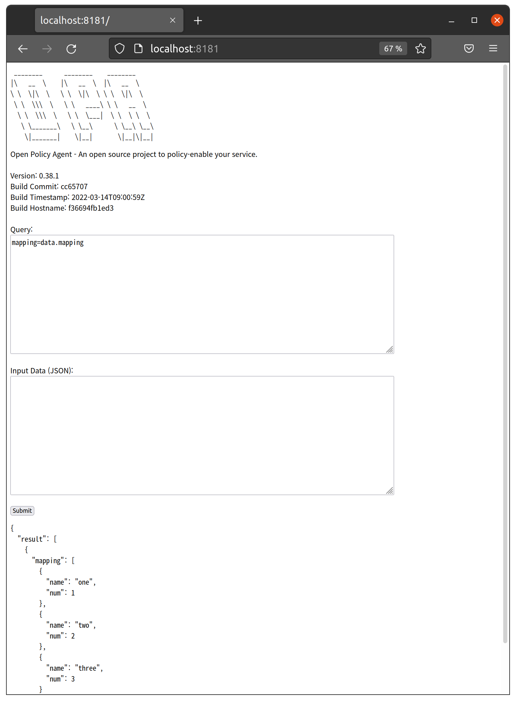

# Chap 12. Policy Synchronization using OPAL

## Contents
- Introduction to OPAL
- Comparison of OPA Bundle and OPAL-applied Policy/Data Management
- Install and Using OPAL

OPAL(Open-Policy Administration Layer) allows synchronization of policies and data between multiple OPA instances. OPA itself provides a synchronization function through a bundle, but there are scenarios where synchronization through OPAL is more suitable. This chapter describes a synchronization method using OPAL.

## Introduction to OPAL
OPAL operates separately from the OPA server and synchronizes policies and data between multiple OPA servers. OPAL can reflect changes from various data sources such as GIT, S3, and DB in real time to OPA instances.

 

Figure 12-1. Architecture of OPAL [^7]

[^7] (Source: https://github.com/permitio/opal/)

The overall structure of OPAL is shown in Figure 12-1. OPAL consists of a server responsible for tracking policy/data from the policy repository and an OPAL client that reflects changes to the OPA instances. Policies are managed through a policy repository tracked by the OPAL server and may also include their own data. However, in the case of frequently changing data from external data sources, such as parameters and settings of policies, the OPAL client can collect data directly from external data sources by delivering updates and data sources to the OPAL client. OPAL does not work in the process of performing policy queries on the OPA server in an application. There is no need to modify the application that requests an OPA query from the OPA server. Although not illustrated in the figure, several OPAL servers can operate in synchronization with each other, so they have performance scalability through clustering (scaling out and connecting several OPAL servers can be done through a backbone channel such as Kafka or Redis).

## Differences from OPA Bundles
OPA can detect and synchronize policy and data changes from servers implementing external bundle APIs through the built-in bundle function. Let's look at the difference between OPA bundle function and OPAL synchronization with an example of Git repository synchronization scenario.

### Scenario Using OPA Bundle

For example, the following process is required to use policies stored in Git through the OPA bundle function. Currently, OPA does not provide direct access to policies stored in Git, so policies must be bundled for polling.

Check out Git's policy modifications through the build script and create a bundle using the bundle tool. This is because OPA supports only packaged bundle forms when loading remote policies. In this case, revision information should be recorded using the OPA build tool. Upload the built bundle to a bundle server that can provide the bundle by HTTP. You can use Amazon S3, Google Cloud Storage, Azure Blob Storage, and Nginx to implement OPA bundles as bundled servers, and see https://www.openpolicyagent.org/docs/latest/management-bundles/#implementations for configuration instructions. While it is possible to manage the bundles built in the Git repository as releases and use them in OPA, OPA uses Etag to detect bundle changes, so it must maintain links to the latest releases.

When using OPA, no matter what method you use, it is necessary to create an OPA bundle of directories in the Git repository.

Bundle server access configuration such as S3 endpoint and AWS authentication is configured in the service section of the OPA configuration file, and bundle file and polling period are set in the bundle section. Using this setting when starting the OPA server, the OPA server's service and bundle plug-in detect changes in the remote bundle according to the settings and reflect them on the OPA server.

### Scenario Using OPAL
OPAL works by pushing data to the OPA server process by the opal-client, which operates as a separate process.

OPAL server polls git changes or receives them through webhook and reflects the changes to OPAL clients. If OPAL is used, configuring OPAL_POLICY_REPO_URL on the OPAL server will fetch the policy from the Git repository. After cloning the contents of the Git repository to the specified directory, you can configure the OPAL server to periodically poll git changes according to the settings or detect changes through the Webhook. The OPAL client receives the changes from the server through the websocket and updates the changes to the OPA server.

### Comparison by Scenario

Let's look at the trade-offs of each scenario. First of all, when using OPA bundles, the bundle build process is required, but policies stored in S3 can be updated immediately without the need to use a separate server. On the other hand, when using OPAL, there is no need for a separate process to build the bundle, but the process lifecycle management is necessary because the OPAL server and the OPAL client operate as separate processes.

When using OPA, when a change in the bundle file is detected, the Etag is changed and the entire bundle must be downloaded. Recently, the concept of delta bundles has been added to OPA to solve this problem, but it is not yet easy to use and manage. However, with OPAL, only changes in git can be detected and updated except in situations such as restarting the client.

If you use OPA bundles, you can configure Go-written applications to initialize OPA plugins and reflect changes through the OPA client library. However, updates via OPAL work in a way that OPAL clients update via the HTTP API provided by the OPA server, so they cannot be used if the OPA is embedded in an application in the form of a client library.

Expanding the OPA bundle plug-in to connect new data sources is difficult to create and dynamically load plug-ins due to the nature of the Go language. It is necessary to modify the source code directly, and if it is a general function, it can be managed upstream by contributing to OPA, but if it is an individual and special code, it is difficult to manage it separately. On the other hand, since OPAL is developed as Python, modules can be installed and loaded, so it is more convenient to develop and link modules that bring external data.

Large-scale synchronization using pub/sub, when client/server channels are intricately intertwined, and when more complex management or integration is required, OPAL is more advantageous. When using OPA bundles, it is difficult to centralize management of these settings if the policies used for each server are different for large systems using multiple OPA servers. If OPAL is used, if the policies used by each server are different, multiple topics can be created to specify the appropriate topics for each server.

Finally, when performance expansion is required, it uses a large number of OPAL servers and provides the ability to configure clusters through synchronization between servers.

Both the OPA bundle and OPAL are based on the external data integration method presented in the official OPA document (see https://www.openpolicyagent.org/docs/latest/external-data/). The method using the OPA bundle corresponds to Option 3, and the method using OPAL corresponds to Option 4. It would be reasonable to view OPAL as an implementation that users can use when they want to implement Option 4. Therefore, it is helpful to refer to the differences between the methods before deciding which method to use, the OPA bundle or OPAL.

## Install and Using OPAL
Let’s try installing OPAL and using it. Let's install it using the pip as guided on the official OPAL website.

First, create a virtual environment with the virtualenv command as follows. At this time, check if the Python version is 3.7 or higher required by OPAL.


```
$ virtualenv helloopal
created virtual environment CPython3.8.10.final.0-64 in 80ms
  creator CPython3Posix(dest=/home/sangkenlee/helloopal, clear=False, no_vcs_ignore=False, global=False)
  seeder FromAppData(download=False, pip=bundle, setuptools=bundle, wheel=bundle, via=copy, app_data_dir=/home/sangkenlee/.local/share/virtualenv)
    added seed packages: pip==22.0.4, setuptools==60.10.0, wheel==0.37.1
  activators BashActivator,CShellActivator,FishActivator,NushellActivator,PowerShellActivator,PythonActivator

```

Activate the virtual environment as follows.

```
$ cd helloopal
$ source bin/activate
```

The OPAL server verifies the client's request through JWT, so let's generate a key for issuing JWT as follows. The -f option allows you to specify the name of the key file to be generated, which you specify as opalkey. A private key (opalkey) and a public key (opalkey.pub) are generated.

```
$ ssh-keygen -t rsa -b 4096 -m pem -f opalkey
```

Check the shell prompt to verify that you are in the hello virtual environment that you created, and install the opal-server and the opal-client as a pip package.

```
(helloopal)  $ pip install opal-server opal-client
```

Once the installation is complete, set the environment variables as follows and run the opal-server.

```
(helloopal)  $ export OPAL_AUTH_PRIVATE_KEY=~/opalkey
(helloopal)  $ export OPAL_AUTH_PUBLIC_KEY=~/opalkey.pub
(helloopal)  $ export OPAL_AUTH_MASTER_TOKEN="HELLO"
(helloopal) $ export OPAL_POLICY_REPO_URL=https://github.com/permitio/opal-example-policy-repo.git 
(helloopal)  $ export OPAL_DATA_CONFIG_SOURCES="{\"config\":{\"entries\":[]}}" 
(helloopal)  $ export OPAL_LOG_COLORIZE=False
(helloopal)  $ opal-server --policy-repo-polling-interval 60 run

    💎 OPAL-SERVER 💎
    Open-Policy Administration Layer - server
 
-- Starting OPAL Server (with uvicron) --
{"text": "2022-03-28T22:38:47.075095+0900 | opal_server.server                      | INFO  | OPAL is running in secure mode - will verify API requests with JWT tokens.\n", "record": {"elapsed": {"repr": "0:00:00.021170", "seconds": 0.02117}, "exception": null, "extra": {}, "file": {"name": "server.py", "path": "/home/sangkenlee/helloopal/lib/python3.8/site-packages/opal_server/server.py"}, "function": "__init__", "level": {"icon": "ℹ️", "name": "INFO", "no": 20}, "line": 106, "message": "OPAL is running in secure mode - will verify API requests with JWT tokens.", "module": "server", "name": "opal_server.server", "process": {"id": 56639, "name": "MainProcess"}, "thread": {"id": 140258057254720, "name": "MainThread"}, "time": {"repr": "2022-03-28 22:38:47.075095+09:00", "timestamp": 1648474727.075095}}}
...
{"text": "2022-03-28T22:38:48.065627+0900 | opal_common.sources.git_policy_source   | INFO  | No new commits: HEAD is at '95638e87d8ea04e97fd0d931ab2932f9251aacce'\n", "record": {"elapsed": {"repr": "0:00:01.011702", "seconds": 1.011702}, "exception": null, "extra": {"head": "95638e87d8ea04e97fd0d931ab2932f9251aacce"}, "file": {"name": "git_policy_source.py", "path": "/home/sangkenlee/helloopal/lib/python3.8/site-packages/opal_common/sources/git_policy_source.py"}, "function": "check_for_changes", "level": {"icon": "ℹ️", "name": "INFO", "no": 20}, "line": 86, "message": "No new commits: HEAD is at '95638e87d8ea04e97fd0d931ab2932f9251aacce'", "module": "git_policy_source", "name": "opal_common.sources.git_policy_source", "process": {"id": 56639, "name": "MainProcess"}, "thread": {"id": 140258057254720, "name": "MainThread"}, "time": {"repr": "2022-03-28 22:38:48.065627+09:00", "timestamp": 1648474728.065627}}}

```

If successfully executed, the above results can be seen. As a result, depending on the platform, the log may be output (Ubuntu) in the form of json as described above or output (MacOS) in color text.

A brief description of the contents is as follows. This example deals with the same content as the official opal document as the overall content, but there are some differences. First, since the default setting value of OPAL_DATA_CONFIG_SOURCES can output an error that confuses beginners, the data source item is set to an empty list. In the Ubuntu environment used in the test, the log is output to json (no format modification configuration was found), and the color change indicator is output to hex in the text in json, making the log difficult to read. To solve this problem, OPAL_LOG_COLORIZE was set as False. This setting is not necessary if the log is output in color text.
Other settings are generally similar to official documents. The environment variables OPAL_AUTH_PRIVATE_KEY and OPAL_AUTH_PUBLIC_KEY specify the private key and public key files previously generated for JWT signature, respectively. The OPAL_AUTH_MASTER_TOKEN environment variable sets the token to be used when requesting JWT issuance from the opal-client. It is more preferable to generate an arbitrary value, but a simple string was used for convenience. OPAL_POLICY_REPO_URL used https://github.com/permitio/opal-example-policy-repo.git provided by OPAL as it was and set to poll every 60 seconds. For more information, see the documents provided by OPAL at https://github.com/permitio/opal/tree/master/docs).

This time, run the client and try to connect to the server. Open another shell and activate the opalhello virtual environment. Then, if you enter the content, you can run the client.

```

(helloopal)  $ export OPAL_AUTH_MASTER_TOKEN="HELLO"
(helloopal)  $ export OPAL_LOG_COLORIZE=False
(helloopal)  $ export OPAL_CLIENT_TOKEN=`opal-client obtain-token $OPAL_AUTH_MASTER_TOKEN`
opal-client run

    OPAL-CLIENT
    Open-Policy Administration Layer - client
 
-- Starting OPAL client (with uvicron) --
{"text": "2022-03-29T00:03:43.444584+0900 | opal_common.fetcher.fetcher_register    | INFO  | Loading FetcherProvider 'FastApiRpcFetchProvider' found at: <class 'opal_common.fetcher.providers.fastapi_rpc_fetch_provider.FastApiRpcFetchProvider'>\n", "record": {"elapsed": {"repr": "0:00:00.080622", "seconds": 0.080622}, "exception": null, "extra": {}, "file": {"name": "fetcher_register.py", "path": "/home/sangkenlee/helloopal/lib/python3.8/site-packages/opal_common/fetcher/fetcher_register.py"}, "function": "__init__", "level": {"icon": "ℹ️", "name": "INFO", "no": 20}, "line": 39, "message": "Loading FetcherProvider 'FastApiRpcFetchProvider' found at: <class 'opal_common.fetcher.providers.fastapi_rpc_fetch_provider.FastApiRpcFetchProvider'>", "module": "fetcher_register", "name": "opal_common.fetcher.fetcher_register", "process": {"id": 60157, "name": "MainProcess"}, "thread": {"id": 139769221486400, "name": "MainThread"}, "time": {"repr": "2022-03-29 00:03:43.444584+09:00", "timestamp": 1648479823.444584}}}
...
{"text": "2022-03-29T00:03:44.496096+0900 | fastapi_websocket_pubsub.pub_sub_client | INFO  | Connected to PubSub server ws://localhost:7002/ws\n", "record": {"elapsed": {"repr": "0:00:01.132134", "seconds": 1.132134}, "exception": null, "extra": {}, "file": {"name": "pub_sub_client.py", "path": "/home/sangkenlee/helloopal/lib/python3.8/site-packages/fastapi_websocket_pubsub/pub_sub_client.py"}, "function": "run", "level": {"icon": "ℹ️", "name": "INFO", "no": 20}, "line": 200, "message": "Connected to PubSub server ws://localhost:7002/ws", "module": "pub_sub_client", "name": "fastapi_websocket_pubsub.pub_sub_client", "process": {"id": 60157, "name": "MainProcess"}, "thread": {"id": 139769221486400, "name": "MainThread"}, "time": {"repr": "2022-03-29 00:03:44.496096+09:00", "timestamp": 1648479824.496096}}}

```


In the first line, the token required to receive the JWT from the server was stored in the OPAL_AUTH_MASTER_TOKEN environment variable. The OPAL_LOG_COLORIZE environment variable is the same as the server. The JWT was received from the server with the opal-client obtain-token command and stored in the OPAL_CLIENT_TOKEN environment variable. After that, when the client is executed, the server and the websocket are connected and the OPAL client starts. The default configuration of the OPAL client starts the OPA server present in the PATH. If OPA is installed in the path and does not change other settings, the server starts with 8181, the default port of the OPA server. Go to localhost:8181 in your web browser and check it out.

 

Figure 12-2. Web UI of the OPA Server

You can view the web UI of the OPA server by accessing localhost:8181. Enter result=data in the Query section. This query takes all the contents of the data area loaded into the OPA (that is, all contents except input) and puts them in a variable called result. Note that the web UI provided by OPA always requires binding when executing queries, so simply entering data does not yield results. After entering the query, click the Submit button to see the results. If you check whether the output result is the same content as the files on https://github.com/permitio/opal-example-policy-repo.git, you can see that it is the same content.

 

Figure 12-3. Query Result of "result=data"


## Data Source Configuration
In the previous example, OPAL_DATA_CONFIG_SOURCES is set to an empty list, but what happens if you run it with the default value? Shut down the old opal-server and opal-client, open a new shell, and activate the opalhello virtual environment. Remove the export OPAL_DATA_CONFIG_SOURCES="{\"config\":{\"entries\":[]}}" line and run the server as follows:

```
(helloopal)  $ export OPAL_AUTH_PRIVATE_KEY=~/opalkey
(helloopal)  $ export OPAL_AUTH_PUBLIC_KEY=~/opalkey.pub
(helloopal)  $ export OPAL_AUTH_MASTER_TOKEN="HELLO"
(helloopal) $ export OPAL_POLICY_REPO_URL=https://github.com/permitio/opal-example-policy-repo.git 
(helloopal)  $ (helloopal)  $ export OPAL_LOG_COLORIZE=False
(helloopal)  $ opal-server --policy-repo-polling-interval 60 run
```

Open another shell, activate the opalhello virtual environment, and then run the client.

```
(helloopal)  $ export OPAL_AUTH_MASTER_TOKEN="HELLO"
(helloopal)  $ export OPAL_LOG_COLORIZE=False
(helloopal)  $ export OPAL_CLIENT_TOKEN=`opal-client obtain-token $OPAL_AUTH_MASTER_TOKEN`
opal-client run
```

When you run the client, you can see the following errors.

```
{"text": "2022-03-29T00:38:43.647847+0900 | opal_client.data.updater                |ERROR  | Failed to fetch url http://localhost:7002/policy-data, got response code 401 with error: {'detail': {'error': 'access token was not provided', 'token': None}}\n", "record": {"elapsed": {"repr": "0:00:02.295990", "seconds": 2.29599}, "exception": null, "extra": {"url": "http://localhost:7002/policy-data", "status": 401, "error": {"detail": {"error": "access token was not provided", "token": null}}}, "file": {"name": "updater.py", "path": "/home/sangkenlee/helloopal/lib/python3.8/site-packages/opal_client/data/updater.py"}, "function": "update_policy_data", "level": {"icon": "❌", "name": "ERROR", "no": 40}, "line": 291, "message": "Failed to fetch url http://localhost:7002/policy-data, got response code 401 with error: {'detail': {'error': 'access token was not provided', 'token': None}}", "module": "updater", "name": "opal_client.data.updater", "process": {"id": 63023, "name": "MainProcess"}, "thread": {"id": 139882438235968, "name": "MainThread"}, "time": {"repr": "2022-03-29 00:38:43.647847+09:00", "timestamp": 1648481923.647847}}}
```

The error means that there is no access token for server access, and the reason for this error is as follows. You can verify the current OPAL settings by executing the opal-server print-config command. When the above command is executed without setting the OPAL_DATA_CONFIG_SOURCES environment variable and the contents of the DATA_CONFIG_SOURCES item are as follows. By default, http://localhost:7002/policy-data is set as the data source.

```
  "DATA_CONFIG_SOURCES": "config=DataSourceConfig(entries=[DataSourceEntry(url='http://localhost:7002/policy-data', config=None, topics=['policy_data'], dst_path='', save_method='PUT')]) external_source_url=None",
```

Since localhost:7002 is the default address of the OPAL server, the client requests /policy-data from the server again for information from the data source. The OPAL server returns a 401 error if the JWT is not in the HTTP Authorization header. So what should we do to prevent these errors from occurring? You can find answers at https://github.com/permitio/opal/blob/master/docker/run-example-with-security.sh. In this script, start the opal-server, run the opal-client opatamin-token, issue the JWT, and save it in the environment variable OPAL_CLIENT_TOKEN. After exiting the opal-server, restart the opal-server by setting OPAL_CLIENT_TOKEN in the header of the data source. Reflecting this information in server execution will be as follows.

```
(helloopal)  $ export OPAL_AUTH_PRIVATE_KEY=~/opalkey
(helloopal)  $ export OPAL_AUTH_PUBLIC_KEY=~/opalkey.pub
(helloopal)  $ export OPAL_AUTH_MASTER_TOKEN="HELLO"
(helloopal)  $ export OPAL_POLICY_REPO_URL=https://github.com/permitio/opal-example-policy-repo.git
 
(helloopal)  $ opal-server run &
(helloopal)  $ sleep 2;
(helloopal)  $ export OPAL_CLIENT_TOKEN=`opal-client obtain-token $OPAL_AUTH_MASTER_TOKEN`
(helloopal)  $ ps -ef | grep opal | grep -v grep | awk '{print $2}' | xargs kill
(helloopal)  $ sleep 5;
 
(helloopal)  $ export OPAL_LOG_COLORIZE=False
 
(helloopal)  $ export OPAL_DATA_CONFIG_SOURCES="{\"config\":{\"entries\":[{\"url\":\"http://localhost:7002/policy-data\",\"config\":{\"headers\":{\"Authorization\":\"Bearer ${OPAL_CLIENT_TOKEN}\"}},\"topics\":[\"policy_data\"],\"dst_path\":\"/static\"}]}}"
 
(helloopal)  $ opal-server --policy-repo-polling-interval 60 run
```

If you run the OPAL server as described above and then run the client again, you can check that no authorization error has occurred.

```
{"text": "2022-03-29T11:01:27.069878+0900 | fastapi_websocket_pubsub.pub_sub_client | INFO  | Connected to PubSub server ws://localhost:7002/ws\n", "record": {"elapsed": {"repr": "0:00:01.145920", "seconds": 1.14592}, "exception": null, "extra": {}, "file": {"name": "pub_sub_client.py", "path": "/home/sangkenlee/helloopal/lib/python3.8/site-packages/fastapi_websocket_pubsub/pub_sub_client.py"}, "function": "run", "level": {"icon": "ℹ️", "name": "INFO", "no": 20}, "line": 200, "message": "Connected to PubSub server ws://localhost:7002/ws", "module": "pub_sub_client", "name": "fastapi_websocket_pubsub.pub_sub_client", "process": {"id": 12917, "name": "MainProcess"}, "thread": {"id": 140619623663424, "name": "MainThread"}, "time": {"repr": "2022-03-29 11:01:27.069878+09:00", "timestamp": 1648519287.069878}}}
```

Let's set up a more practical data source. https://github.com/permitio/opal-fetcher-postgres has an example of a provider which imports data from Postgres. Install an example and set it up in a helloopal virtual environment.

```
(helloopal) $ git clone https://github.com/permitio/opal-fetcher-postgres
(helloopal) $ cd opal-fetcher-postgres
(helloopal) $ pip install .
...
Successfully installed asyncpg-0.23.0 click-7.1.2 opal-fetcher-postgres-0.0.1 pydantic-1.8.2
```

If the module was successfully installed, install postgres.

With Linux, you can install it with the following command:

```
$ sudo apt install postgresql postgresql-contrib
$ sudo systemctl start postgresql.service
```

For MacOS, run the following command:

```
$ brew install postgresql
$ brew services postgresql start
```

When the installation is complete, run psql with postgres account privileges, create users and databases as follows, and exit psql with the quit command. 

For Linux, run psql as follows.

```
$ sudo -u postgres psql
psql (12.9 (Ubuntu 12.9-0ubuntu0.20.04.1))
Type "help" for help.
```


For MacOS, run psql as follows.

```
$ psql postgres
```

When psql is executed, create a user as follows:

```
postgres=# CREATE USER helloopal PASSWORD 'helloopal';
CREATE ROLE
postgres=# create database helloopal owner helloopal;
CREATE DATABASE
postgres=# quit
```

Again, connect to the account and database you just created in the shell as follows.

```
$ psql -U helloopal -h 127.0.0.1 -d helloopal
```

Run the following query to create a sample table and add data.

```
CREATE TABLE IF NOT EXISTS mapping (
  num INT NOT NULL,
  name varchar(250) NOT NULL,
  PRIMARY KEY (num)
);
 
INSERT INTO mapping (num, name) values (1,’one’),(2,’two’),(3,’three’);
```

Let's run a query to see if the data has been added well.

```
helloopal=> select * from mapping;
num | name  
-----+-------
   1 | one
   2 | two
   3 | three
(3 rows)
```

Now that the data is ready, let's set up an opal server and a client. First, the server added opal_fetcher_postgres.provider to the OPAL_FETCH_PROVIDER_MODULES environment variable and set postgres connection information and queries to be executed in OPAL_DATA_CONFIG_SOURCES as follows.

```
(helloopal) $ export OPAL_AUTH_PRIVATE_KEY=~/opalkey
(helloopal) $ export OPAL_AUTH_PUBLIC_KEY=~/opalkey.pub
(helloopal) $ export OPAL_AUTH_MASTER_TOKEN="HELLO"
(helloopal) $ export OPAL_POLICY_REPO_URL=https://github.com/permitio/opal-example-policy-repo.git 
(helloopal) $ export OPAL_LOG_COLORIZE=False
(helloopal) $ export OPAL_FETCH_PROVIDER_MODULES=opal_common.fetcher.providers,opal_fetcher_postgres.provider
(helloopal) $ export OPAL_DATA_CONFIG_SOURCES="{\"config\":{\"entries\":[{\"url\":\"postgresql://helloopal@127.0.0.1:5432/helloopal\",\"config\":{\"fetcher\":\"PostgresFetchProvider\",\"query\":\"SELECT * from mapping;\",\"connection_params\":{\"password\":\"helloopal\"}},\"topics\":[\"policy_data\"],\"dst_path\":\"mapping\"}]}}"
 
(helloopal) $ opal-server --policy-repo-polling-interval 60 run
```

When the server is running, try running the client. Since the server delivers the data source URL and the postgres connection occurs on the client, the client also needs to set the OPAL_FETCH_PROVIDER_MODULES environment variable.

```
(helloopal) $ export OPAL_AUTH_MASTER_TOKEN="HELLO"
(helloopal) $ export OPAL_LOG_COLORIZE=False
(helloopal) $ export OPAL_CLIENT_TOKEN=`opal-client obtain-token $OPAL_AUTH_MASTER_TOKEN`
(helloopal) $ export OPAL_FETCH_PROVIDER_MODULES=opal_common.fetcher.providers,opal_fetcher_postgres.provider
(helloopal) $ opal-client run
```

Once the client is running, go to localhost:8181 and verify that the postgres data is reflected in the OPA. Since mapping has been set to dst_path in the previous data source setting, it must be connected to data.mapping when data is loaded into OPA. Type mapping=data.mapping in Query and click Submit. You can see that the data added to the database earlier has been loaded.

What kind of work is needed to add data to the OPA? Since opal_fetcher_postgres is a simple sample implementation, it does not provide updates through polling. Therefore, a data update event must be issued.

 

Figure 12-4. Query Result of "mapping=data.mapping"

Let's issue a data update event as follows.

```
(helloopal) $ export OPAL_AUTH_MASTER_TOKEN="HELLO"
(helloopal) $ export OPAL_LOG_COLORIZE=False
(helloopal) $ export OPAL_DATASOURCE_TOKEN=`opal-client obtain-token $OPAL_AUTH_MASTER_TOKEN --type datasource`
(helloopal) $ opal-client publish-data-update $OPAL_DATASOURCE_TOKEN --src-url postgresql://helloopal@127.0.0.1:5432/helloopal --src-config "{\"fetcher\":\"PostgresFetchProvider\",\"query\":\"SELECT * from mapping;\",\"connection_params\":{\"password\":\"helloopal\"}}" -t policy_data --dst-path mapping
Publishing event:
id=None entries=[DataSourceEntry(url='postgresql://helloopal@127.0.0.1:5432/helloopal', config={'fetcher': 'PostgresFetchProvider', 'query': 'SELECT * from mapping;', 'connection_params': {'password': 'helloopal'}}, topics=['policy_data'], dst_path='mapping', save_method='PUT')] reason='' callback=UpdateCallback(callbacks=[])
Event Published Successfully
```

First of all, it is noteworthy that the JWT token type was issued as a datasource. The opal-client publish-data-update command issues events, but the configuration is complicated, not just specifying the source of the event. Because opal_fetcher_postgres does not have the ability to read and process url-based settings when updating, it also sets key data source settings, topics, and OPA data target paths. If you check the results of the mapping=data.mapping query in the web UI again after issuing the event, you can see that data has been added.

When implementing a custom data fetcher module, it is necessary to update the data of the source only by specifying the name of source and some parameters you want to override.

## Summary
In this chapter, we briefly explained the difference between using OPAL and updating the policy/data of OPA when using OPAL bundles. In addition, for users who are using OPAL for the first time, the usage method was briefly explained and the confusing parts were guided. Since OPAL faithfully implements the policy and data update scenario presented by OPAL, the contents of this chapter will be able to provide insight into OPA policy/data management even if OPAL is not used directly. Although this chapter has not explained everything about OPAL, I hope it can be a good starting point. For more information about OPAL, visit the official website: https://opal.ac.