# Chap 2. OPA Installation and Usage

## Contents
- Installation of OPA
- Installation of VScode OPA Plugin
- Usage of VScode OPA Plugin
 
This chapter describes the basic installation and usage of OPA and related tools so that you can conveniently run the examples covered in subsequent chapters. OPA provides plug-ins for the most widely used editor Visual Studio Code (VSCode) by recent developers, as well as how to leverage the capabilities offered by OPA through the VSCode plug-in.

## Installation of OPA
Because OPA consists of a single binary like any other program written in Go, installation simply requires downloading the appropriate binary for the platform.OPA binaries can act as a REPL, an unittest runner, a code coverage tool, a REST server and etc, depending on arguments. Unless embedding OPA as a client library, the OPA binary can take full advantage of all features. Let's take a look at installing and using the client library later and first take a quick look at how to install and use the OPA binary.
 
OPA installation methods can be found in the OPA documentation( https://www.openpolicyagent.org/docs/latest/#running-opa). Referring to the document, let's install it as follows.


OPA binaries work equally well in Windows, Linux, and Mac OS environments. However, for Windows environments, using shells such as Git Bash can cause problems with the cursor not being displayed when using REPL.


### Linux
Download the binary with the following curl command and save it under the name opa.

```bash
$ curl -L -o opa https://openpolicyagent.org/downloads/latest/opa_linux_amd64
```

After downloading the file, execute the chmod command to grant permission.

```bash
$ chmod 755 opa
```

If you are a bash user, add the following to the .bashrc file to add the OPA binary location to the PATH env variable.

```bash
export PATH=<<the path of directory contains the opa binary>>
```
 
The above line can be added using editors such as vi, and if you want to add it using a command, run the command as follows in the shell if there is an opa binary in the directory /opt/opa.

```bash
$ echo 'export PATH=$PATH:/opt/opa' >> ~/.bashrc
```

To immediately reflect environment variables without refreshing the shell or restarting Linux, run the following command:
 
```bash
$ source ~/.bashrc
```
 
### Mac OS
You can download it with the curl command, just like the Linux environment, but the url is different.

```bash 
$ curl -L -o opa https://openpolicyagent.org/downloads/latest/opa_darwin_amd64
```

After downloading the file, run chmod 755 opa to grant permission.
 
```bash
$ chmod 755 opa
```

On Mac OS, setting the PATH environment variable is essentially the same as Linux. Previous versions of Catalina use bash, but from Catalina they use zsh. If the shell prompt appears as $, bash, and if % appears, zsh. The two shells have different file locations for loading environment variables. If zsh, in the home directory.You can modify the .zsh file instead of the .bashrc file.

To modify and reload environment variables, do the following:
 
```bash
% echo 'export PATH=$PATH:/opt/opa' >> ~/.zsh
% source ~/.zsh
```

OPA could also be installed using homebrew. Just do the following:

```bash
%  brew install opa
```

### Windows
In windows, download https://openpolicyagent.org/downloads/latest/opa_windows_amd64.exe, rename it opa.exe, and save it.
 
The process of registering environment variables on Windows is complex and varies slightly from version to version of Windows. In this book, versions prior to Windows 10 have been discontinued from official support, and are described as Windows 10 criteria. First, when you open the Control Panel and type "Advanced System Settings" in the Control Panel search window, as shown in Figure 2-1, the "View Advanced System Settings" menu appears, and when clicked, the Advanced tab in the System Properties dialog box is displayed as shown in Figure 2-2.

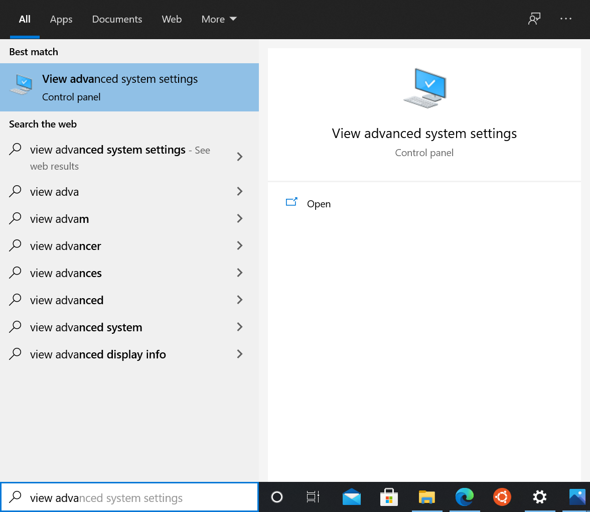

Figure 2-1. Advanced System Settings in Control Panel

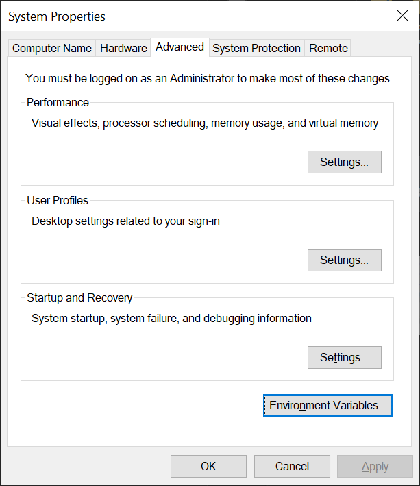

Figure 2-2. System Properties Dialog Box

When you click the Environment Variables... button, the Environment Variables dialog box is displayed as shown in Figure 2-3.

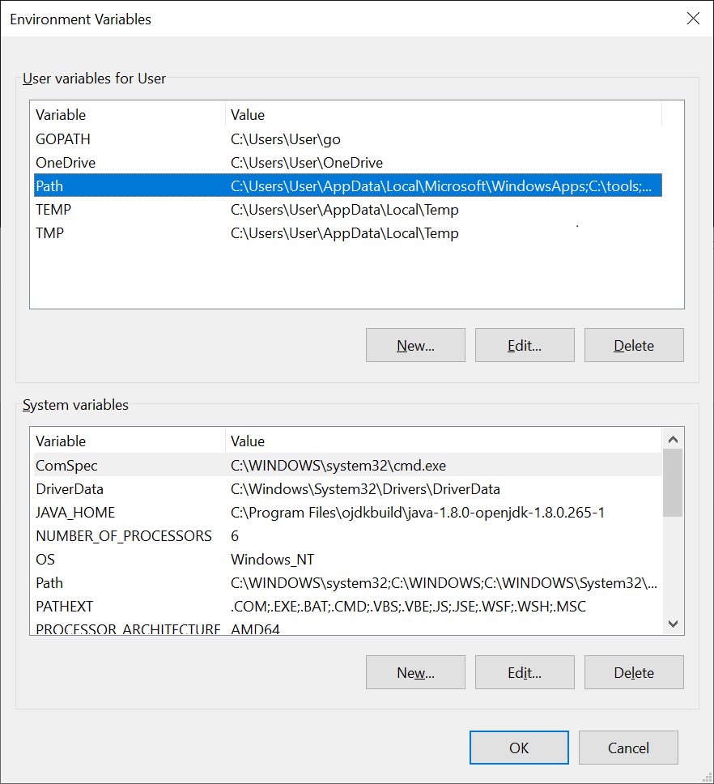

Figure 2-3. Environment Variables Dialog Box
 
By clicking the Path entry in the[User variable (U) for User]  section, the Path environment variable can be modified as shown in Figure 2-4. Adds a directory path to which opa is installed to the list. Figure 2-4 adds a "C:\opbook" path.

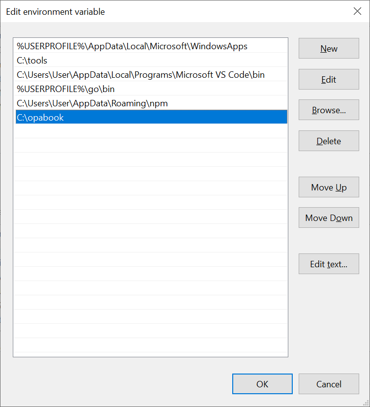

Figure 2-4. Edit Environment Variables Dialog Box

After adding an environment variable, click OK and Apply to reflect the environment variable, and exit and restart the shell or editor to apply the environment variable.
 
### Test Installation
Let's run the OPA installation to see if it works properly.  Move to the directory where opa is installed.  Run ./opa in Linux and Mac OS, and simply run opa in Windows. If you have registered PATH environment variables, you can run them directly with opa. If installed normally, the following results can be seen.

```bash
$ ./opa
An open source project to policy-enable your service.
 
Usage:
opa [command]
 
Available Commands:
bench Benchmark a Rego query
build Build an OPA bundle
check Check Rego source files
deps Analyze Rego query dependencies
eval Evaluate a Rego query
fmt Format Rego source files
help Help about any command
parse Parse Rego source file
run Start OPA in interactive or server mode
sign Generate an OPA bundle signature
test Execute Rego test cases
version Print the version of OPA
 
Flags:
-h, --help help for opa
 
Use "opa [command] --help" for more information about a command.
```

## Install of Visual Studio Code and OPA Plug-in
Install of Visual Studio Code 
By accessing https://code.visualstudio.com/, you can view the screen shown in Figure 2-5, and download and install Visual Studio Code. After accessing the homepage, click the Download button to install it. The Visual Studio Code is briefly referred to as the VSCode in later parts.

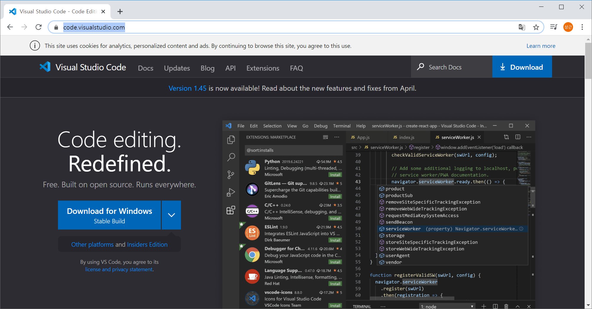

Figure 2-5. https://code.visualstudio.com/
 
The most convenient way to run VSCode is to go from the shell to the parent project directory containing the source with the cd command, run the command code. or run the code <Project Top Directory> command.
 
If you have run VSCode outside the project directory, simply run File -> Open Directory to open the top directory of the project.

### Install of vscode-opa plugin
Let's install the OPA vscode-opa plugin in VSCode. Click the Extensions icon as shown in Figure 2-6, or enter [Ctrl + Shift + x] (in Mac OS, [Cmd + Shift + x]) to open the extension page. The Open Policy Agent can then be entered into the search bar to see the screen shown in Figure 2-6. Let's check if it's a plug-in from Torin Sandall, the core OPA developer, and click Install to install it.

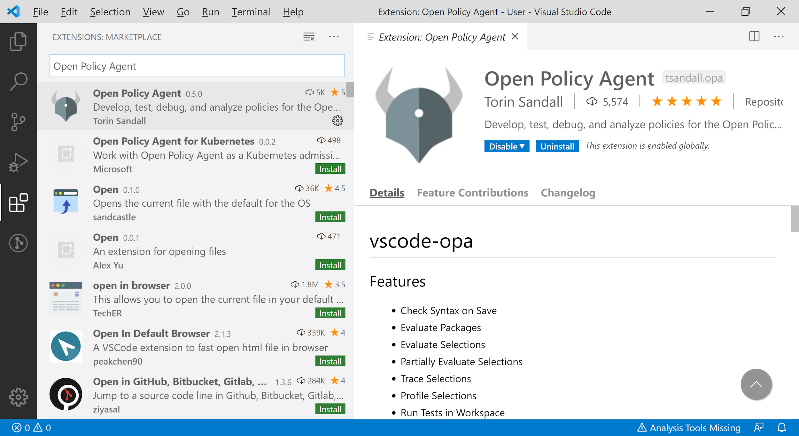

Figure 2-6. Searching vscode-opa Plugin
 
Create a directory called hello_vscode_opa, navigate to it, run vscode . to open the project. Then the screen appears as shown in Figure 2-7.

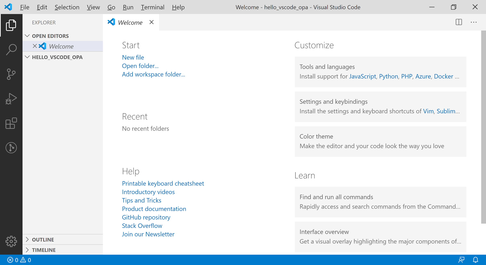

Figure 2-7. vscode-opa Plugin

This book uses bright themes for the readability of the book. If you want to change the theme, you can run the File -> Preferences -> Color Theme menu.
Basic usage of vscode-opa
A rego file is required to create and test OPA policies. Move the mouse over the project directory (HELLO_VSCODE_OPA) and the icons appear, and click the New File icon as shown in Figure 2-8.

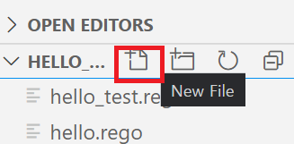

Figure 2-8. New File Icon
 
When the File Name text box is displayed, let's create a rego file by typing hello.rego.
 
Select the View -> Command Palette menu, or enter the shortcut [Ctrl + Shift + P] (in Mac OS, [Cmd + Shift + P]) to call the command window. If you type opa here, you can use the commands provided by vscode-opa as shown in Figure 2-9.
 
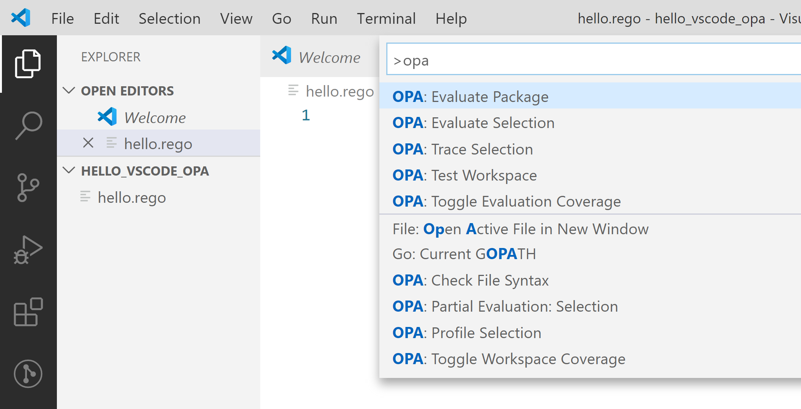

Figure 2-9. OPA command menu

Next, let's make a real sample code and learn how to use it.

First, enter the following rego code into the just created hello.rego file and save it.
 
[import, template:"acefull", title:"chap2/hello_vscode_opa/hello.rego"](../code/chap2/hello_vscode_opa/hello.rego)

After saving the file, invoke the OPA command menu to execute the OPA Evaluate Package command. The Evaluate Package command executes OPA rules from the same package and shows the results.
 
As shown in Figure 2-10, a window is created under the title output.json, with running time as annotation on the top line, and result values on the bottom as json.

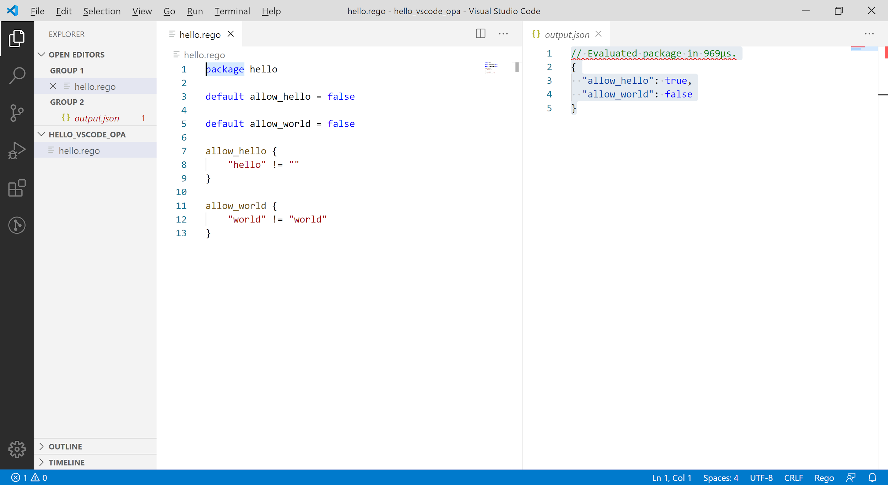

Figure 2-10. OPA Evaluation Results
 
This time, let's not run the entire package, but choose a specific rule and run it.

Double-click on the allow_hello rule of line 7 as shown in Figure 2-11 highlights the part related to that rule as shown in Figure 2-8.

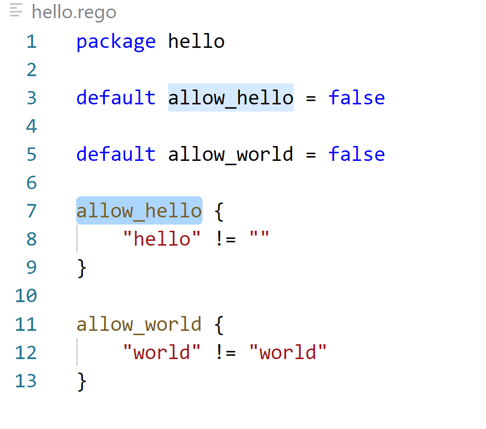

Figure 2-11. OPA Rule Selection

When the selection is highlighted, [OPA: Evaluate Selection] is executed through the command menu, the results are shown in Figure 2-12.

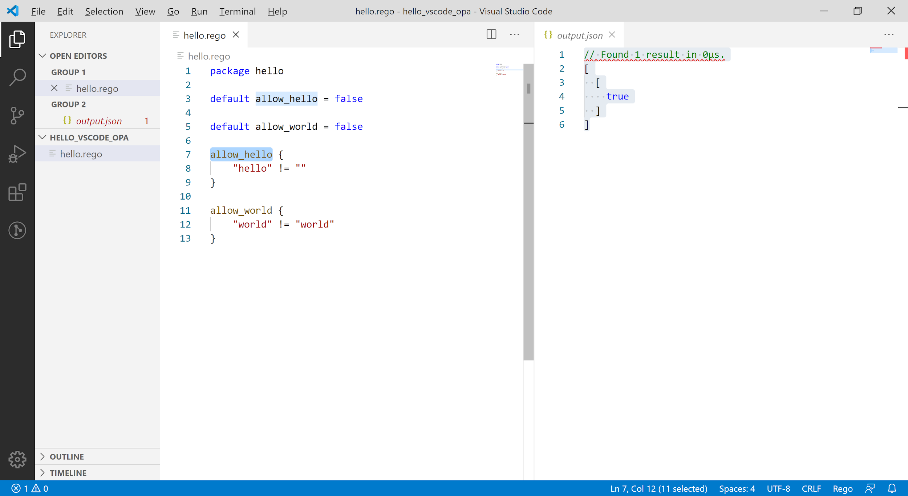

Figure 2-12. Result of OPA: Evaluate Selection 

If you look at the results of the execution, you can see a slight difference from when you run the [OPA: Evaluate Package]. The output.json window is created and the time displayed with the annotation first is the same. However, the results are output from an array of values without keys, unlike when the package was evaluated because only a single rule was evaluated. Pressing the [Alt] key  allows users to select both allow_hello and allow_world rules at the same time, but multiple selections of different rules do not work simultaneously.
 
Running OPA: Trace Selection with the same rule selected produces the tracking results of the evaluation process in the Output portion of Figure 2-13. Tracking results are discussed in detail in later chapters.

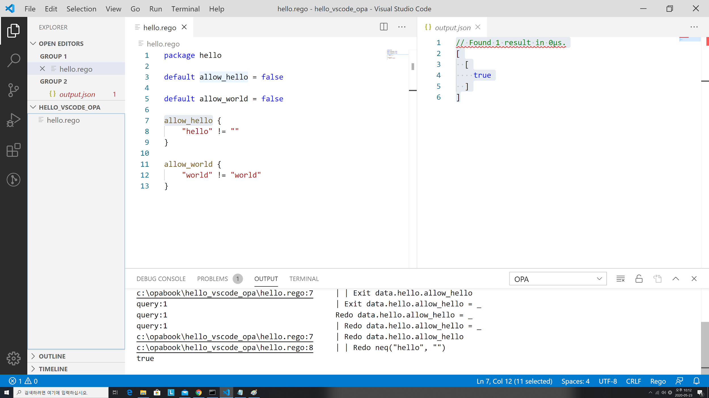

Figure 2-13. Results of OPA: Trace Selection

OPA: Profile Selection command allows performance profiling results to be seen in the Output window, as shown in Figure 2-14. Units are expressed in nanoseconds, but the current rule is too simple to measure to zero.

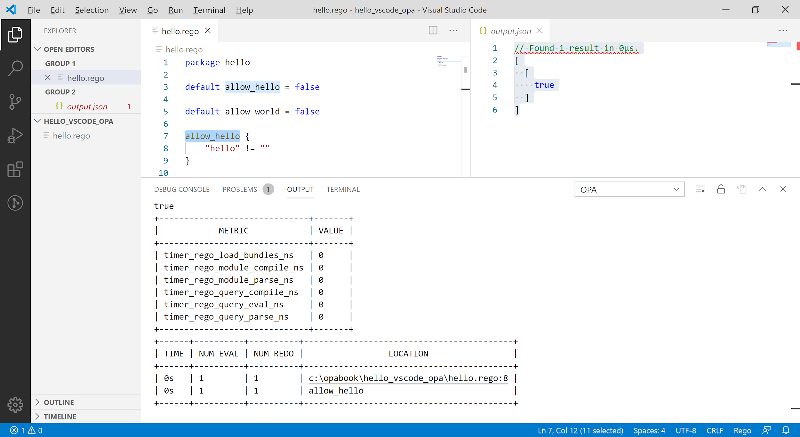

Figure 2-14. OPA: Results of OPA: Profile Selection

When the OPA: Toggle Evaluation Coverage command is launched, the Policy Evaluation Coverage section is displayed as shown in Figure 2-15. The OPA: Google Workspace Coverage menu also allows you to turn coverage off and on a workspace-by-workspace basis. Coverage-related features are more useful when it comes to unit testing.

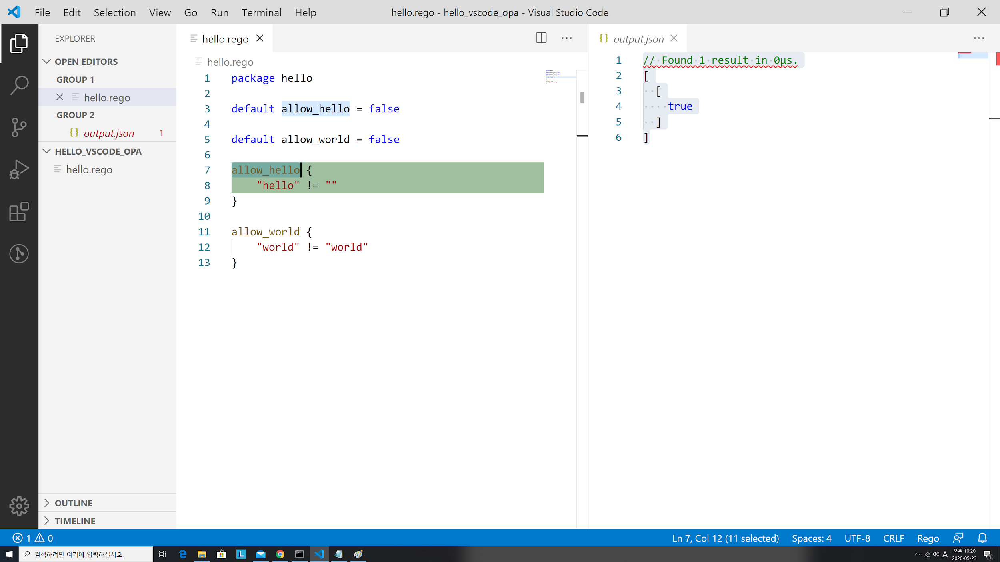

Figure 2-15. Results of OPA: Toggle Evaluation
 
Let's run a unit test this time. First, let's write a separate file called hello_test.rego as follows.
 
[import, template:"acefull", title:"chap2/hello_vscode_opa/hello_test.rego"](../code/chap2/hello_vscode_opa/hello_test.rego)

In OPA, rules starting with test_ are considered tests. When the test is run, it tells us whether the test was successful or not, as shown in Figure 2-16. Details of the test code are discussed in later chapters.

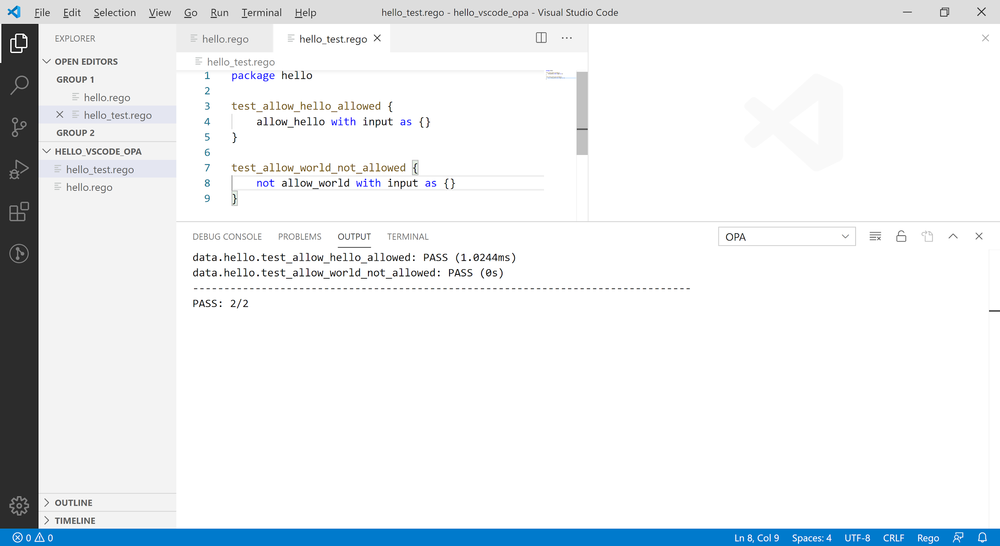

Figure 2-16. Execution Result of Unittest

The last OPA: Check File Syntax command displays errors in the Rego grammar when executing other commands. There won't be a lot of use for this command.

## Summary
This chapter deals with the installation and use of OPA and related tools. Readers will learn how to use basic OPA-related tools through Chapter 2, and will be ready to run and test examples of what will be described in subsequent chapters.

The following chapters cover the Rego language used by OPA to write policies.


