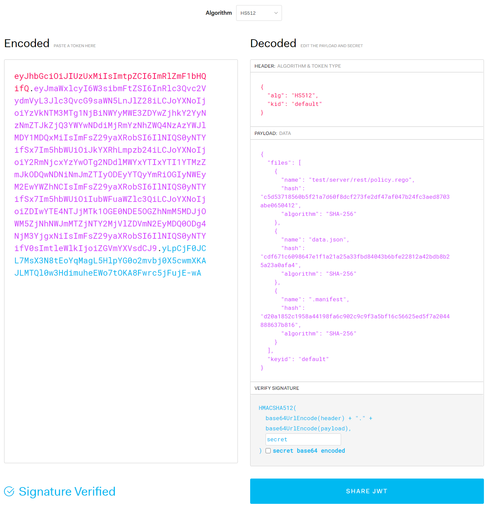
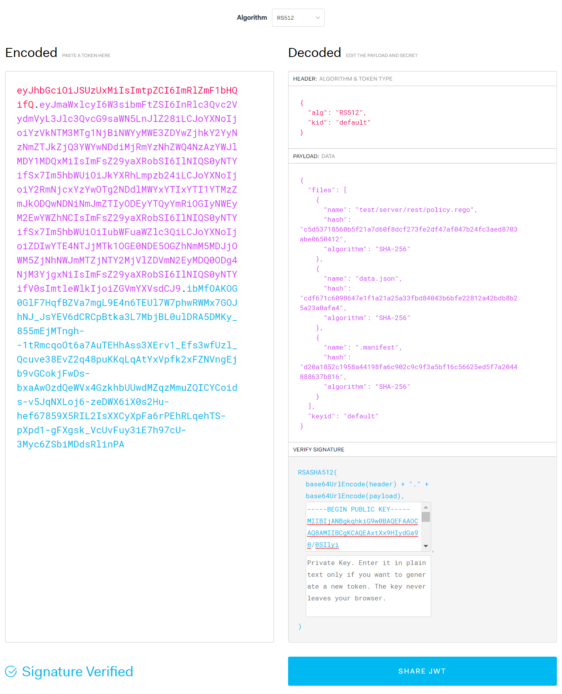

# Chap 6. OPA Bundle

## Contents
- How to bundle OPA data and policies
- Generate Bundles with OPA Tools
- Signature and Validation of OPA bundles
 
An OPA bundle is a tar.gz file with a specific format. The OPA bundle includes data files in JSON or YAML format, and rego files. OPA bundles make it easier to manage multiple data and policy files packaged into a single file. Manifest can also be used to specify the root or revision of a data file and to add a signature file to ensure its validity.
 
## OPA Bundle Generation
### Creation of OPA bundles manually
To manually create an OPA bundle:

First, create a directory for bundles. Let's create a directory named bundletest.

The data.json (or data.yaml) and each rego file must then be located in each directory. The name of the data file included in the bundle must always be data.json or data.yaml. Multiple data.json or data.yaml can exist because bundle directories can have multiple directories in their child.

Created test/server/rest, users, and role subdirectories under the bundletest directory.
Then, in the test/server/rest directory, policy.rego is located, and in the users and roles directory, a data.json file containing user information and role information created respectively. The test/server/rest/policy.rego is similar to the previous policy.rego, but some changes have been made to refer to users from users/data.json as data.users.users. For the actual source files used for bundle testing, refer to the contents of the chap6/bundletest directory. 

[import, template:"acefull", title:"chap6/bundletestopatool/test/server/rest/policy.rego
"](../code/chap6/bundletestopatool/test/server/rest/policy.rego)

The content of users/data.json is the same as that of users.json.

[import, template:"acefull", title:"chap6/bundletestopatool/users/data.json
"](../code/chap6/bundletestopatool/users/data.json)


role/data.json is briefly written with the following:

[import, template:"acefull", title:"chap6/bundletestopatool/role/data.json
"](../code/chap6/bundletestopatool/role/data.json)

To create a bundle, create a tarball (tar.gz) file as follows: The following command generates the bundle.tar.gz file, including the test, role, and users directories:

```
$ tar cvzf bundle.tar.gz test role users
a test
a test/server
a test/server/rest
a test/server/rest/policy.rego
a role
a role/data.json
a users
a users/data.json
```

If bundle.tar.gz is created, let's load it from OPA and check it out. Instead of specifying the policy and data files individually, you can specify bundle.tar.gz when issuing OPA commands as follows: You can check the loaded content by outputting the result loaded with the data command.

```
$ opa run bundle.tar.gz
OPA 0.23.2 (commit 661ec2f, built at 2020-08-24T18:49:53Z)
 
Run 'help' to see a list of commands and check for updates.
 
> data
{
  "role": {
    "role": [
      "manager",
      "staff"
    ]
  },
  "test": {
    "server": {
      "rest": {
        "allowed": false
      }
    }
  },
  "users": {
    "users": {
      "alice": {
        "role": "staff"
      },
      "bob": {
        "role": "manager"
      }
    }
  }
}
```

If you look at the loaded content, you can see that users.role and others are added to the hierarchy. For example, in the previous example, information from a user named Alice could be accessed as data.users[alice] but after inclusion in the bundle, it should be accessed using data.users.users[alice]. If you want to access data.users["alice"] as before, you can place data.json or data.yaml directly in the bundle top-level directory so that hierarchies are not included.

Bundle may contain manifest files. The manifest file is named .manifest and is a JSON file in the following format: revision refers to a revision number that can distinguish bundles, either by the commit ID of the git repository or by the version given by the organization's policy. roots specifies the root directory of the package to be exposed externally. The default value for roots is [“"], which includes all directory structures in the bundle and does not have packages imported from outside. If there is a package imported from outside the bundle (such as HTTP), it must be declared in the root for additional packages to be used.

``` 
{
  "revision" : "6973caed1c345856387b5476d562897356dbe056",
  "roots": [“test”, "roles", “users“]
}
```

To add a manifest, you can include .manifest in the list of files in the tar command.

```
$ tar cvzf bundle.tar.gz test role users .manifest
a test
a test/server
a test/server/rest
a test/server/rest/policy.rego
a role
a role/data.json
a users
a users/data.json
a .manifest
```

### OPA Bundle Tools
The OPA bundle generation tool provided by OPA makes it easier to generate bundles. However, the bundle generated by the OPA is provided with all the data combined and flattened into one file optimized for minimal traffic use.

To generate an OPA bundle, run the following command from the bundle's top-level directory: For the actual source files used for bundle testing, refer to the contents of the chap6/bundletestopatool directory.
 
```
$ opa build .
```

The command was executed with only the test, role, and users directories present, not including .manifest.

Even if the manifest file exists in that directory, it is not included in the generated bundle. To include revisions and others in manifest, it must be passed to the arguments of the bundle tool.

The bundle file name generated by executing the command above is bundle.tar.gz. First, let's create a temp directory, copy bundle.tar.gz, and release the tarball.

``` 
$ tar xvzf bundle.tar.gz
tar: Removing leading '/' from member names
x data.json
x test\\server\\rest\\policy.rego
x .manifest
```

The data files in the role and users directories were merged to include a single data.json file, and the policy.rego file remained in place.

First of all, if you check the manifest generated by the bundled tool, it is as follows. No revision or package root was specified as an argument, indicating that the manifest created with default values.

```
{"revision":"","roots":[""]}
```

If you look at the generated data.json, you can see that role/data.json and users/data.json have been merged to remove spaces.

```
{"role":{"role":["manager","staff"]},"users":{"users":{"alice":{"role":"staff"},"bob":{"role":"manager"}}}}
```

The contents of the test/server/rest/policy.rego file inside the bundle were included in the bundle without significant changes:

``` 
package test.server.rest
 
default allowed = false
 
allowed {
  name := input.name
  data.users.users[name].role == "manager"
}
```

The generated bundle is loaded with the opa run bundle.tar.gz command and tested to work the same as the manually created bundle.
 
## Signing OPA Bundle
OPA supports HMAC, RSA and ECSDA for bundle signatures. The HMAC method is to verify the integrity of messages with hash values by sharing the same secret code for signature and verification. On the other hand, RSA and ECSDA use a public key encryption method to sign and verify with a private key. Let's use each method to sign the bundle and verify the signed bundle when loading it.
 
### Bundle Signing and Verification with HMAC
To sign a bundle with HMAC, specify the HMAC-related signature algorithm such as HS256, HS384, HS512 in the singing-alg argument as the following command when creating the bundle, and enter the code to be used as a password in the signing-key. When signing a bundle, you should specify the --bundle argument rather than the target directory immediately. See the contents of the chap6/bundlehmac directory for the actual source files used for bundle testing.

```
$ opa build --signing-alg HS512 --signing-key secret --bundle .
```

HS256, HS384, and HS512 are algorithms to be used for HMAC signatures, and the larger the number, the stronger the security and makes the signature larger. Codes specified by signing-key shall use the same code when verifying the signature.

Copy the generated bundle file (bundle.tar.gz) to the directory you created temporarily, and then extract it. When extracted, the signature is recorded differently from the existing bundle.You can see the addition of .signatures.json.

```
$ tar xvzf bundle.tar.gz
tar: Removing leading `/' from member names
x data.json
x test\\server\\rest\\policy.rego
x .manifest
x .signatures.json
```

The format of the .signature file is as follows: It has a string array value for a key called signatures, which can now contain only one signature in the file, so the array is always 1 in size. The signature value is a string in typical JWT format.

```json
{
  "signatures": [
    "eyJhbGciOiJIUzUxMiIsImtpZCI6ImRlZmF1bHQifQ.eyJmaWxlcyI6W3sibmFtZSI6InRlc3Qvc2VydmVyL3Jlc3QvcG9saWN5LnJlZ28iLCJoYXNoIjoiYzVkNTM3MTg1NjBiNWYyMWE3ZDYwZjhkY2YyNzNmZTJkZjQ3YWYwNDdiMjRmYzNhZWQ4NzAzYWJlMDY1MDQxMiIsImFsZ29yaXRobSI6IlNIQS0yNTYifSx7Im5hbWUiOiJkYXRhLmpzb24iLCJoYXNoIjoiY2RmNjcxYzYwOTg2NDdlMWYxYTIxYTI1YTMzZmJkODQwNDNiNmJmZTIyODEyYTQyYmRiOGIyNWEyM2EwYWZhNCIsImFsZ29yaXRobSI6IlNIQS0yNTYifSx7Im5hbWUiOiIubWFuaWZlc3QiLCJoYXNoIjoiZDIwYTE4NTJjMTk1OGE0NDE5OGZhNmM5MDJjOWM5ZjNhNWJmMTZjNTY2MjVlZDVmN2EyMDQ0ODg4NjM3YjgxNiIsImFsZ29yaXRobSI6IlNIQS0yNTYifV0sImtleWlkIjoiZGVmYXVsdCJ9.yLpCjF0JCL7MsX3N8tEoYqMagL5HlpYG0o2mvbj0X5cwmXKAJLMTQl0w3HdimuheEWo7tOKA8Fwrc5jFujE-wA"
  ]
}
```

To verify this signature, you can access jwt.io and select the signature algorithm in the debugger as shown in Figure 6-1, enter the contents of the signature in the Encoded section, and enter the secret you specified by code in the Verification of Signature section. The .singnature.json itself, which contains the signature file without the code, is a jwt file, so you can see the content, but you need the code to verify that the content has not changed since signing.

To verify the generated bundle, you can load it with the following command: The signing-alg argument can specify the same algorithm used for signing, and the run command takes over the signature code as the verification-key factor. Finally, if you do not specify the --bundle (or –b) option, you load the bundle without verifying the signature, so if you want to verify it, you must specify the --bundle option.

```
$ opa run --signing-alg HS512 --verification-key secret --bundle bundle.tar.gz
```

If the code for signature verification or signature algorithm is specified differently than when it is signed, the signature verification fails and the bundle does not load as follows:

``` 
$ opa run --signing-alg HS512 --verification-key nosecret --bundle bundle.tar.gz
error: load error: bundle bundle.tar.gz: Failed to verify message: failed to match hmac signature
```

 
 
Figure 6-1. Verification of bundle signatures signed with HS512

Bundle signature and verification using asymmetric key signatures
The basic behavior is the same as HMAC-based bundle signing and verification, except for algorithms that specify that private keys and public keys are used for signing and validation instead of the same signature code for signing and validation. It is recommended to use a version later than 0.25 because the bundle verification function using asymmetric key signatures does not work with bugs until version 0.24. For your information, the bug was found by the author while testing the book and reported to the https://github.com/open-policy-agent/opa/issues/2796 issue. Readers are also encouraged to actively report on github issues if there is a function that does not work as expected among OPA functions.

First, let's test RSA algorithm-based bundle signing and verification.

Prior to the test, the public and private keys shall be generated using openssl. openssl will be installed by default in Linux or Mac OS environments. In a Windows environment, you can install the Git client for Windows and run the openssl command by utilizing the included gitbash. Let's first run the next openssl command to create it.

``` 
$ openssl genrsa -out private_key.pem 2048
$ openssl rsa -in private_key.pem -out public_key.pem -pubout
```

The first command generates an RSA private key named private_key.pem with a size of 2048 bits. The second command generates a public_key.pem matching the private_key.pem.
 
When the public key and private key are generated, let's sign the bundle using the private key private_key.pem. As previously discussed, only the signing-alg and signing-key arguments need to be replaced and the private_key.pem and public_key.pem can be located in the bundled directory to generate signatures for those key files, so keep them in a different directory for reference. See the contents of the Chap6/bundlersa directory for the actual source files used for bundle testing.

```
$ opa build --signing-alg RS512 —signing-key ../private_key.pem --bundle .
```

When the bundle is generated, copy the bundle file to the directory you created temporarily and extract it with the tar xvzf bundle.tar.gz command. The JWT token contains .signing.json's contents, and if the contents of the file to be included in the bundle have not been modified, the header of the JWT and the last signature are different, but the data (or payload) containing the hash values of the file is the same as before.

To verify the bundle, you can only change the signing-alg and verification-key to verify it in the same way as before.

```
$ opa run --signing-alg RS512 —verification-key ../public_key.pem --bundle bundle.tar.gz
```

Let's then sign and validate the ECSDA algorithm-based bundle. In the case of ECSDA algorithms, the signature and verification methods are similar. However, there is a difference in how keys are generated. The following command was used to create a public key ecpublic_key.pem that matches the private key ecprivate_key.pem.

``` 
$ openssl ecparam -name prime256v1 -genkey -noout -out ecprivate_key.pem
$ openssl ec -in ecprivate_key.pem -pubout –out ecpublic_key.pem
```

While RSA keys set the number of bits at generation, the ECSDA algorithm sets the kind of elliptical curve to use. In the example above, prime256v1 is used, and the types of elliptical curves available can be determined by the command: The Go-based library used by the OPA does not support all elliptical curves, so if the key does not work, please recreate it with prime256v1 and confirm.

```
$ openssl ecparam –list_curves
secp112r1 : SECG/WTLS curve over a 112 bit prime field
secp112r2 : SECG curve over a 112 bit prime field
secp128r1 : SECG curve over a 128 bit prime field
secp128r2 : SECG curve over a 128 bit prime field
... (omitted) ...
brainpoolP512r1: RFC 5639 curve over a 512 bit prime field
brainpoolP512t1: RFC 5639 curve over a 512 bit prime field
SM2 : SM2 curve over a 256 bit prime field
```

To verify your signature on jwt.io, simply enter the contents of private_key.pem where you entered the code before, as shown in Figure 6-2.

To generate a signed bundle based on an ECDSA, you can run the following command: From the previous commands, we can see that only the signing-alg and signing-key arguments are different. For the actual source files used for bundle testing, refer to the contents of the chap6/bundlecdsa directory.

``` 
$ opa build --signing-alg ES512 --signing-key ../ecprivate_key.pem --bundle .
```

 

Figure 6-2. Verification of bundle signatures signed with RS512
 
To load a bundle signed with ECDSA, you can run the following command:

``` 
$ opa run --signing-alg ES512 —verification-key ../ecpublic_key.pem --bundle bundle.tar.gz
```

### Creating Bundle Signature File Only
Only .signatures files can be created using the opa sign command. If only .signatures files are created separately and included in the tarball creation, the bundle generated by the tar cvzf command can also be signed. If you want to create a signature file only, you can change the opa command to sign instead of build as follows:

```
$ opa sign --signing-alg ES512 --signing-key ../ecprivate_key.pem --bundle .
```

## Summary
In this chapter, we examined the generation and signature of OPA bundles, and how to verify them. OPA bundles make it easy to package and manage files consisting of multiple data and policies, and manage version information of bundles through metadata. Signatures also allow us to verify that policies or data have not been tampered with fraudulently.

In the next chapter, we discuss how to integrate OPA with other components of the system in various forms, and in this process, how to periodically poll and update bundles on separate remote servers.
