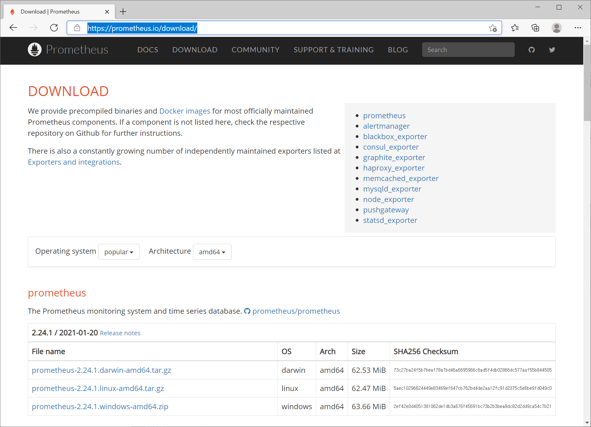
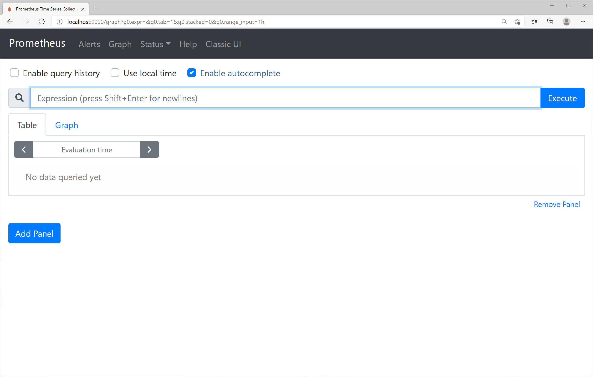
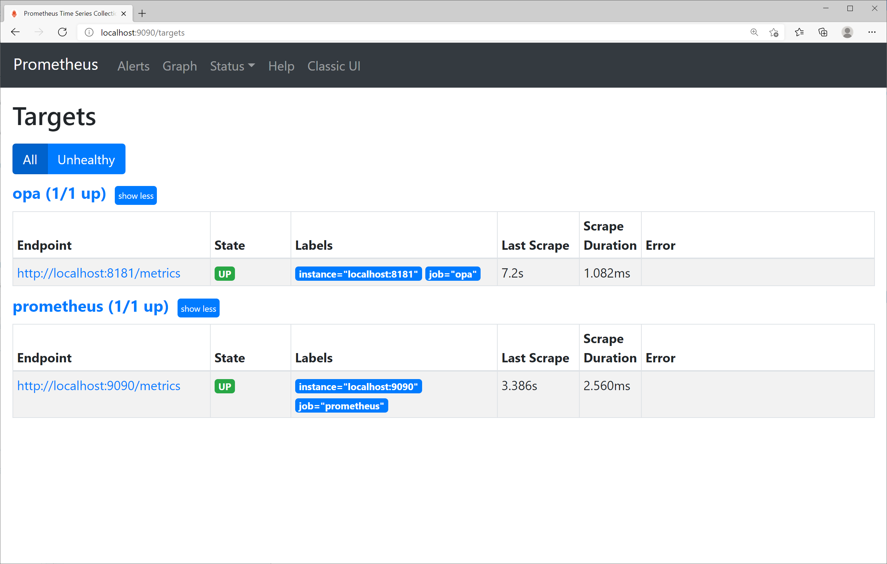
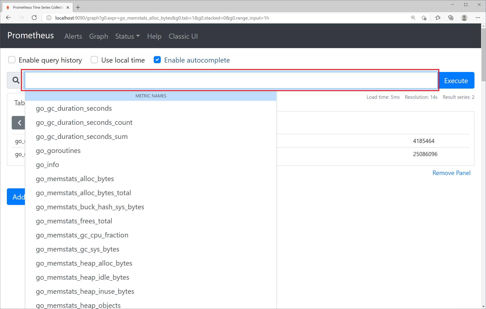
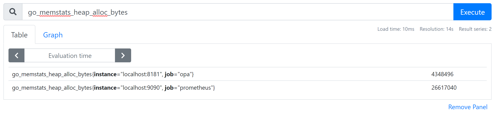
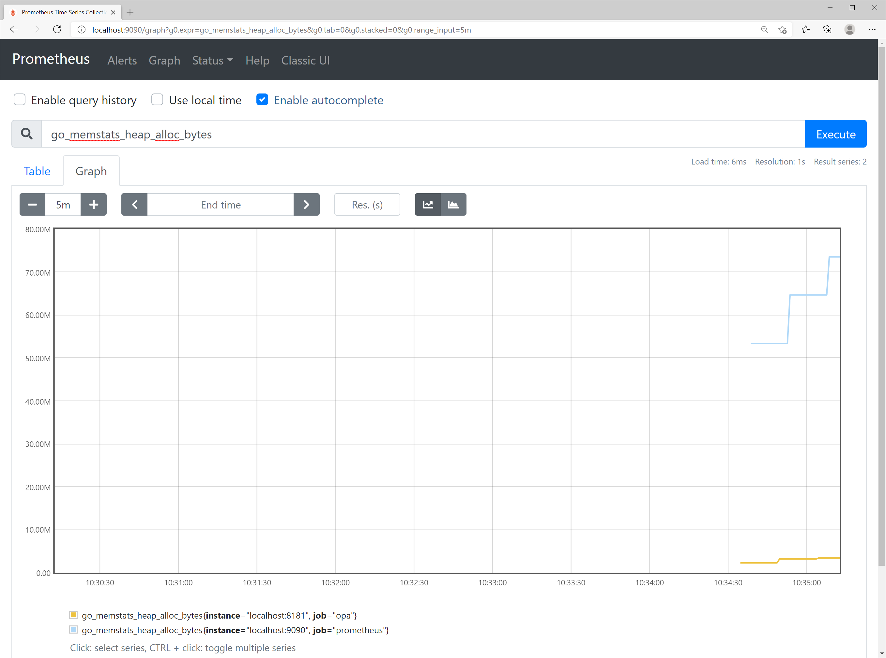

# Chap 8. Monitoring

## Contents
- Monitoring the OPA server using Prometheus.
- Examine Performance of OPA Query 
- Health Check of OPA Server
- Deliver OPA Server Status and Decision Log to a Remote Server

OPA provides monitoring functions such as monitoring the server's resource usage, metrics on policy evaluation performance, and health checks. It also provides a function of delivering status information and decision logs to remote servers. Chapter 8 explains each monitoring and logging function and examines how to actually utilize the monitoring and logging function.

## Monitoring the OPA server using Prometheus
### Metrics provided by OPA
The OPA server provides metrics to enable monitoring through Prometheus. The metric information may be obtained by requesting a GET for the /metrics URL of the server address. Let's start the OPA server used in the previous example and check it through curl request.

```
$ curl localhost:8181/metrics
# HELP go_gc_duration_seconds A summary of the pause duration of garbage collection cycles.
# TYPE go_gc_duration_seconds summary
go_gc_duration_seconds{quantile="0"} 0
go_gc_duration_seconds{quantile="0.25"} 0
go_gc_duration_seconds{quantile="0.5"} 0
go_gc_duration_seconds{quantile="0.75"} 0
go_gc_duration_seconds{quantile="1"} 0
go_gc_duration_seconds_sum 0
go_gc_duration_seconds_count 1
# HELP go_goroutines Number of goroutines that currently exist.
# TYPE go_goroutines gauge
go_goroutines 11
# HELP go_info Information about the Go environment.
# TYPE go_info gauge
go_info{version="go1.14.9"} 1
# HELP go_memstats_alloc_bytes Number of bytes allocated and still in use.
# TYPE go_memstats_alloc_bytes gauge
go_memstats_alloc_bytes 1.6354e+06
# HELP go_memstats_alloc_bytes_total Total number of bytes allocated, even if freed.
# TYPE go_memstats_alloc_bytes_total counter
go_memstats_alloc_bytes_total 2.561792e+06
# HELP go_memstats_buck_hash_sys_bytes Number of bytes used by the profiling bucket hash table.
# TYPE go_memstats_buck_hash_sys_bytes gauge
go_memstats_buck_hash_sys_bytes 5449
# HELP go_memstats_frees_total Total number of frees.
# TYPE go_memstats_frees_total counter
go_memstats_frees_total 14273
# HELP go_memstats_gc_cpu_fraction The fraction of this program's available CPU time used by the GC since the program started.
# TYPE go_memstats_gc_cpu_fraction gauge
go_memstats_gc_cpu_fraction 0.00013690667167567526
# HELP go_memstats_gc_sys_bytes Number of bytes used for garbage collection system metadata.
# TYPE go_memstats_gc_sys_bytes gauge
go_memstats_gc_sys_bytes 1.614352e+06
# HELP go_memstats_heap_alloc_bytes Number of heap bytes allocated and still in use.
# TYPE go_memstats_heap_alloc_bytes gauge
go_memstats_heap_alloc_bytes 1.6354e+06
# HELP go_memstats_heap_idle_bytes Number of heap bytes waiting to be used.
# TYPE go_memstats_heap_idle_bytes gauge
go_memstats_heap_idle_bytes 4.431872e+06
# HELP go_memstats_heap_inuse_bytes Number of heap bytes that are in use.
# TYPE go_memstats_heap_inuse_bytes gauge
go_memstats_heap_inuse_bytes 3.694592e+06
# HELP go_memstats_heap_objects Number of allocated objects.
# TYPE go_memstats_heap_objects gauge
go_memstats_heap_objects 11632
# HELP go_memstats_heap_released_bytes Number of heap bytes released to OS.
# TYPE go_memstats_heap_released_bytes gauge
go_memstats_heap_released_bytes 4.235264e+06
# HELP go_memstats_heap_sys_bytes Number of heap bytes obtained from system.
# TYPE go_memstats_heap_sys_bytes gauge
go_memstats_heap_sys_bytes 8.126464e+06
# HELP go_memstats_last_gc_time_seconds Number of seconds since 1970 of last garbage collection.
# TYPE go_memstats_last_gc_time_seconds gauge
go_memstats_last_gc_time_seconds 1.612095757679477e+09
# HELP go_memstats_lookups_total Total number of pointer lookups.
# TYPE go_memstats_lookups_total counter
go_memstats_lookups_total 0
# HELP go_memstats_mallocs_total Total number of mallocs.
# TYPE go_memstats_mallocs_total counter
go_memstats_mallocs_total 25905
# HELP go_memstats_mcache_inuse_bytes Number of bytes in use by mcache structures.
# TYPE go_memstats_mcache_inuse_bytes gauge
go_memstats_mcache_inuse_bytes 10224
# HELP go_memstats_mcache_sys_bytes Number of bytes used for mcache structures obtained from system.
# TYPE go_memstats_mcache_sys_bytes gauge
go_memstats_mcache_sys_bytes 16384
# HELP go_memstats_mspan_inuse_bytes Number of bytes in use by mspan structures.
# TYPE go_memstats_mspan_inuse_bytes gauge
go_memstats_mspan_inuse_bytes 89896
# HELP go_memstats_mspan_sys_bytes Number of bytes used for mspan structures obtained from system.
# TYPE go_memstats_mspan_sys_bytes gauge
go_memstats_mspan_sys_bytes 98304
# HELP go_memstats_next_gc_bytes Number of heap bytes when next garbage collection will take place.
# TYPE go_memstats_next_gc_bytes gauge
go_memstats_next_gc_bytes 4.194304e+06
# HELP go_memstats_other_sys_bytes Number of bytes used for other system allocations.
# TYPE go_memstats_other_sys_bytes gauge
go_memstats_other_sys_bytes 1.501623e+06
# HELP go_memstats_stack_inuse_bytes Number of bytes in use by the stack allocator.
# TYPE go_memstats_stack_inuse_bytes gauge
go_memstats_stack_inuse_bytes 262144
# HELP go_memstats_stack_sys_bytes Number of bytes obtained from system for stack allocator.
# TYPE go_memstats_stack_sys_bytes gauge
go_memstats_stack_sys_bytes 262144
# HELP go_memstats_sys_bytes Number of bytes obtained from system.
# TYPE go_memstats_sys_bytes gauge
go_memstats_sys_bytes 1.162472e+07
# HELP go_threads Number of OS threads created.
# TYPE go_threads gauge
go_threads 10
```

From the results, it can be seen that the following same form is repeated.

```
#HELP <metric> <description of metric>
# TYPE <metric> <metric types such as gauge, counter, histogram, etc.>
<metric> <value of measurement>
```

In addition, it can be seen that the content of the metric exposes system metrics such as memory, thread, and garbage collection (Go language used in OPA implementation also has garbage collection).
When a query is requested from the OPA server, metric information for the corresponding request may be obtained. The OPA server was asked for a request including a query in which the request was successful, a query in which the request failed, and the request with invalid parameters using the following command. For reference, /v1/compile is an API that returns a simplified policy by partial evaluation when a Rego file is POSTed, and if the content to be POST is empty, a invalid parameter error occurs.
 
```
$ curl localhost:8181/v1/data/test/server/rest/allowed -d {\"input\":{\"name\":\"bob\"}}
{"result":true}
 
$ curl localhost:8181/v1/data/test/server/rest/allowed/aaa -d {\"input\":{\"name\":\"bob\"}}
{
"code": "internal_error",
"message": "1 error occurred: 1:1: rego_type_error: undefined ref: data.test.server.rest.allowed.aaa\n\tdata.test.server.rest.allowed.aaa\n\t^^^^^^^^^^^^^^^^^^^^^^^^^^^^^\n\thave: boolean"
}
 
$ curl -i -X POST localhost:8181/v1/compile
HTTP/1.1 400 Bad Request
Content-Type: application/json
Date: Thu, 04 Feb 2021 06:25:25 GMT
Content-Length: 96
 
{
"code": "invalid_parameter",
"message": "error(s) occurred while decoding request: EOF"
}
```

If you request localhost:8181/metrics again, you can see that items for HTTP requests have been added for each API and error code as follows. http_request_duration_seconds is a histogram type, indicating how the request response time is distributed by interval (le="0.005" which is within 0.005 seconds, that is, within 5 ms, and le="0.01" which is within 10 ms...). Since http_request_duration_seconds_sum represents the number of items collected, the average response time can be obtained by dividing sum by count.

``` 
# HELP http_request_duration_seconds A histogram of duration for requests.
# TYPE http_request_duration_seconds histogram
http_request_duration_seconds_bucket{code="200",handler="v1/data",method="post",le="0.005"} 1
http_request_duration_seconds_bucket{code="200",handler="v1/data",method="post",le="0.01"} 1
http_request_duration_seconds_bucket{code="200",handler="v1/data",method="post",le="0.025"} 1
http_request_duration_seconds_bucket{code="200",handler="v1/data",method="post",le="0.05"} 1
http_request_duration_seconds_bucket{code="200",handler="v1/data",method="post",le="0.1"} 1
http_request_duration_seconds_bucket{code="200",handler="v1/data",method="post",le="0.25"} 1
http_request_duration_seconds_bucket{code="200",handler="v1/data",method="post",le="0.5"} 1
http_request_duration_seconds_bucket{code="200",handler="v1/data",method="post",le="1"} 1
http_request_duration_seconds_bucket{code="200",handler="v1/data",method="post",le="2.5"} 1
http_request_duration_seconds_bucket{code="200",handler="v1/data",method="post",le="5"} 1
http_request_duration_seconds_bucket{code="200",handler="v1/data",method="post",le="10"} 1
http_request_duration_seconds_bucket{code="200",handler="v1/data",method="post",le="+Inf"} 1
http_request_duration_seconds_sum{code="200",handler="v1/data",method="post"} 0.0017316
http_request_duration_seconds_count{code="200",handler="v1/data",method="post"} 1
http_request_duration_seconds_bucket{code="400",handler="v1/compile",method="post",le="0.005"} 1
http_request_duration_seconds_bucket{code="400",handler="v1/compile",method="post",le="0.01"} 1
http_request_duration_seconds_bucket{code="400",handler="v1/compile",method="post",le="0.025"} 1
http_request_duration_seconds_bucket{code="400",handler="v1/compile",method="post",le="0.05"} 1
http_request_duration_seconds_bucket{code="400",handler="v1/compile",method="post",le="0.1"} 1
http_request_duration_seconds_bucket{code="400",handler="v1/compile",method="post",le="0.25"} 1
http_request_duration_seconds_bucket{code="400",handler="v1/compile",method="post",le="0.5"} 1
http_request_duration_seconds_bucket{code="400",handler="v1/compile",method="post",le="1"} 1
http_request_duration_seconds_bucket{code="400",handler="v1/compile",method="post",le="2.5"} 1
http_request_duration_seconds_bucket{code="400",handler="v1/compile",method="post",le="5"} 1
http_request_duration_seconds_bucket{code="400",handler="v1/compile",method="post",le="10"} 1
http_request_duration_seconds_bucket{code="400",handler="v1/compile",method="post",le="+Inf"} 1
http_request_duration_seconds_sum{code="400",handler="v1/compile",method="post"} 0
http_request_duration_seconds_count{code="400",handler="v1/compile",method="post"} 1
http_request_duration_seconds_bucket{code="500",handler="v1/data",method="post",le="0.005"} 1
http_request_duration_seconds_bucket{code="500",handler="v1/data",method="post",le="0.01"} 1
http_request_duration_seconds_bucket{code="500",handler="v1/data",method="post",le="0.025"} 1
http_request_duration_seconds_bucket{code="500",handler="v1/data",method="post",le="0.05"} 1
http_request_duration_seconds_bucket{code="500",handler="v1/data",method="post",le="0.1"} 1
http_request_duration_seconds_bucket{code="500",handler="v1/data",method="post",le="0.25"} 1
http_request_duration_seconds_bucket{code="500",handler="v1/data",method="post",le="0.5"} 1
http_request_duration_seconds_bucket{code="500",handler="v1/data",method="post",le="1"} 1
http_request_duration_seconds_bucket{code="500",handler="v1/data",method="post",le="2.5"} 1
http_request_duration_seconds_bucket{code="500",handler="v1/data",method="post",le="5"} 1
http_request_duration_seconds_bucket{code="500",handler="v1/data",method="post",le="10"} 1
http_request_duration_seconds_bucket{code="500",handler="v1/data",method="post",le="+Inf"} 1
http_request_duration_seconds_sum{code="500",handler="v1/data",method="post"} 0
http_request_duration_seconds_count{code="500",handler="v1/data",method="post"} 1
```

Information provided through /metrics is not related to being allowed or denied as a result of OPA's policy evaluation because it represents success or failure in terms of API requests. Logs must be checked to confirm the results of these policy evaluations.

## Monitoring using Prometheus
Prometheus allows you to collect and monitor metrics in the above form when you request the /metrics URL.

Let's install Prometheus and monitor the OPA server. To install Prometheus, you must access https://prometheus.io/download/ and download Prometheus as shown in Figure 8-1. Choose the right version for the platform you use and download it.

 
 
Figure 8-1. Prometheus download page

Download Prometheus and extract it, and you can see the following list.

``` 
LICENSE
NOTICE
console_libraries
consoles
prometheus
prometheus.yml
promtool
```

The configuration file of Prometheus is prometheus.yml, and the contents are as follows. Basically, Prometheus itself provides the same /metrics API as the monitoring target and operates at 9090 ports. Therefore, the content of the scrape_config section is monitoring the prometheus itself.

``` 
global:
  scrape_interval: 15s
  evaluation_interval: 15s
alerting:
  alertmanagers:
  - static_configs:
    - targets:
      # - alertmanager:9093
 
rule_files:
  # - "first_rules.yml"
  # - "second_rules.yml"
 
scrape_configs:
  - job_name: 'prometheus’
    static_configs:
    - targets: ['localhost:9090']
```

To add monitoring for OPA, set job_name to opa and target address to OPA server address localhost:8181 in the same form under the prometheus section of the scrap_configs section. The modified content may be found in the source file Chap8/prometheus/prometheus.yml.

``` 
scrape_configs:
  - job_name: 'prometheus’
    static_configs:
    - targets: ['localhost:9090']
  - job_name: 'opa’
    static_configs:
    - targets: ['localhost:8181']
```

Prometheus can be started by executing the following command.

```
$ ./prometheus --config.file=prometheus.yml
```

After Prometheus started, enter localhost:9090 in your browser to access Prometheus.

 
 
Figure 8-2. Prometheus start page

To check whether the registered OPA-related metrics are being collected well, click the Status -> Targets menu to see the screen shown in Figure 8-3. If registered normally, the status of the oppa target is UP

 
  
Figure 8-3. Prometheus OPA target

If you click the Graph menu again, leave your cursor in the Metrics Search window, and press the spacebar to enter a space, you can see the list of available metrics as shown as Figure 8-4.

 

Figure 8-4. Check the list of metrics available in Prometheus
 
Let's choose go_memstats_heap_alloc_bytes, which represents the amount of currently allocated memory in bytes. After selection, click the Execute button to see the current measured value as shown in Figure 8-5. Both Prometheus and OPA provide the corresponding metric, so two results are shown. If you want to view only the contents related to opa, you can apply a filter like go_memstats_heap_alloc_bytes{job="opa"}.

 

Figure 8-5. go_memstats_heap_alloc_bytes metrics
 
If you click the Graph tab and adjust the time interval to [+], [-], you can see the change in metric as shown in Figure 8-6.

 

Figure 8-6. Graph of go_memstats_heap_alloc_bytes metric
 
Prometheus stores metric values collected in a time series database, so monitoring data while the Prometheus server operates and the OPA server operates to provide metrics is not lost. If performance degradation of OPA servers occurs, checking various metrics at the time of degradation will greatly help identify problems.
 
Let's graph the average response time associated with HTTP requests. In order to stack data to draw graphs, randomly irregular numbers of curl requests were repeatedly sent to the server.

Prometheus provides a dedicated query language called PromQL, which is used to create a query that obtains request response time at 1-minute intervals as follows.

avg(rate(http_request_duration_seconds_sum[1m]) / rate(http_request_duration_seconds_count[1m])) by (code, handler, instance, method)
 
Visualizing this as a graph is shown in Figure 8-7.

 

Figure 8-7. Http mean response time graph visualized by Prometheus

### Monitoring Single Query Performance
When an API is requested, the OPA server provides performance information for the corresponding request along with the result if it is an API that can be provided as a metric. If you need such metric information, you can cross metrics=true as the HTTP query parameter of the request. When metrics=true is exceeded, the response returns an object containing metric values to the metrics field together.

```
$ curl localhost:8181/v1/data/test/server/rest/allowed?metrics=true -d {\"input\":{\"name\":\"bob\"}}
{"metrics":{"counter_server_query_cache_hit":0,"timer_rego_external_resolve_ns":0,"timer_rego_input_parse_ns":0,"timer_rego_query_compile_ns":0,"timer_rego_query_eval_ns":0,"timer_rego_query_parse_ns":0,"timer_server_handler_ns":0},"result":true}
```

## Health Check of OPA Server
The OPA server provides an API for health check. Health check is mainly used for the purpose of checking the status of a service on a Kubernetes or proxy server rather than calling the API directly.
 
If you request the /health URL from the OPA server, it returns HTTP response code 200 OK if it works normally, and if there is a problem, it returns 500 Internal Server Error. While the OPA server is operating, you can check it as follows using curl. If the status is 200 OK, nothing is output as the curl default option, so the –i option was added to check the response code.

``` 
$ curl –i localhost:8181/health
HTTP/1.1 200 OK
Content-Type: application/json
Date: Wed, 03 Feb 2021 05:38:05 GMT
Content-Length: 2
```

In addition to /health, which can check the status of the server itself, OPA can also check the status of bundles or plugins using  /health?bundles and  /health?plugins.

```
$ curl -i localhost:8181/health?bundles
HTTP/1.1 200 OK
Content-Type: application/json
Date: Wed, 03 Feb 2021 05:57:03 GMT
Content-Length: 2
 
{}
 
$ curl -i localhost:8181/health?plugins
HTTP/1.1 200 OK
Content-Type: application/json
Date: Wed, 03 Feb 2021 05:57:10 GMT
Content-Length: 2
 
{}
```

The  /health?bundles or  /health?plugins returns 200 OK only when all bundles or all plug-ins are operating normally. It is not possible to check which of the several plugins or bundles is not operating normally by health check. This information should be utilized by the /status API, which does not call from the client to the GET, but acts by POSTing JSON to the /status URL of the server.

In addition, in the case of bundles, failure of subsequent updates once all bundles are loaded does not affect health checks. This is because if the bundle update fails, the OPA server is not unavailable, and the service is available in the existing state.

## OPA Server Status and Decision Log
The OPA status information and decision log operate in a different way than the Prometheus metric and health check that return information in response to a GET call. When enabled in the OPA setting on the designated server, the content is POSTed to the /status URL and /log URL of the remote server or output to the console in the form of JSON. In a Kubernetes environment, content output in JSON form from the OPA container to the console can be processed by collecting them into the EFK (ElasticSearch + Fluentd + Kibana) stack.

### OPA Server Status
Start the web server for bundle with the following command in the chap8/statusandlog directory of the source code. For reference, bundles in the policy directory are the same as those used in Chapter 7.

```
$ python3 -m http.server --bind localhost 8080 --directory .
```

The OPA configuration file used in chapter 7 is modified as follows. The modified part is the status and division_logs section, and adding the console: true part will output the log to the window where the OPA server is started.

```
services:
  example:
    url: http://localhost:8080/policy/v1
    response_header_timeout_seconds: 5
 
labels:
  region: prod
  depart: dev1
  service: example
 
bundles:
  example:
    service: example
    resource: bundles/example/bundle.tar.gz
    persist: true
    polling:
      min_delay_seconds: 60
      max_delay_seconds: 120
    signing:
      keyid: global_key
 
keys:
  global_key:
    algorithm: RS512
    key: |
      -----BEGIN PUBLIC KEY-----
      MIIBIjANBgkqhkiG9w0BAQEFAAOCAQ8AMIIBCgKCAQEAxtXx9HIydGa90/0SIlyi
      G6uJS3xTZqr+IfIA1YZrgdhpIJSIW4Wj19R56X6tzr5AMw4Z/FfcR7E+5/9Q30y9
      8bvCDMM+58RPIhL4fyHLZeLR2ysMHgXt3aQ1epTKJA+AP2ndQu7nzYJ/ZgIzQkGO
      3AR9IfYva5D9x9d5KxsBS6S5FyAfT9zspWtN9OO2Vu8jH9G/vWnLagYD8hXfTiaa
      U+ujkB0OSlOOWDVbXPO0Aw/z7GKyc9Zg/TF2Vq8/SJjw0j1FlgJCC+tXBx8SYXuQ
      TxsjpMHAGiWg5slt+FpvSQEcZjPlvUN+tnvsUxfnVpyMDmxKMvdRtzAy0BaL/wpe
      GQIDAQAB
      -----END PUBLIC KEY-----
 
decision_logs:
  console: true
status:
  console: true
```

Let's run the following command to start the OPA server.

```
$ opa run –s –c opaconf_console.yaml
```

When the server starts, several logs are output, and the status log part is as follows. The OPA log is not formatted and spaces are removed, so each JSON object is output one line at a time, but the [Format Document] function was executed and sorted in VsCode to make it easier for users to see.

```
{
    "bundles": {
        "example": {
            "last_request": "2021-02-04T14:48:10.1058913Z",
            "last_successful_activation": "2021-02-04T14:48:10.1089159Z",
            "last_successful_download": "2021-02-04T14:48:10.1058913Z",
            "last_successful_request": "2021-02-04T14:48:10.1058913Z",
            "metrics": {
                "timer_rego_data_parse_ns": 0,
                "timer_rego_load_bundles_ns": 5000900,
                "timer_rego_module_compile_ns": 0,
                "timer_rego_module_parse_ns": 0
            },
            "name": "example"
        }
    },
    "labels": {
        "id": "8a3cf7d6-5123-44ad-87dd-c38f749f6ed7",
        "version": "0.26.0"
    },
    "level": "info",
    "metrics": {
        "prometheus": {
...
            "go_threads": {
                "help": "Number of OS threads created.",
                "metric": [
                    {
                        "gauge": {
                            "value": 11
                        }
                    }
                ],
                "name": "go_threads",
                "type": 1
            }
        }
    },
    "msg": "Status Log",
    "plugins": {
        "bundle": {
            "state": "OK"
        },
        "decision_logs": {
            "state": "OK"
        },
        "discovery": {
            "state": "OK"
        },
        "status": {
            "state": "OK"
        }
    },
    "time": "2021-02-04T23:48:10+09:00",
    "type": "openpolicyagent.org/status"
}
```

A brief description of the status log is as follows. First, since the msg field is "Status Log", it may be seen that it is in a state log. Through the labels section, you can know the OPA version and the unique ID of the server.
 
The bundle field includes information such as the time when the bundle was attempted to be downloaded from the remote bundle server, the last successfully downloaded time, and various processing times for loading from the OPA. Through this content, it is possible to determine whether there was any problem with periodically updating the policy bundle remotely. If the local bundle file was loaded by a factor without downloading it from a remote server, the bundle will not be updated periodically, so the bundle field is not included in the status log.

In the metrics field, there is a prometheus object, and the metric for prometheus is converted into JSON format as it is and included.

In the plugins field, the status of each plug-in is displayed per plug-in. Plugins are activated according to configurations, but because external URLs are defined as services, discovery plugins are activated and bundles are activated because remote bundles are configured. In addition, status and decision_logs were also activated because state information and decision logs were activated, respectively. In the health check, only the normal operation of the entire plug-in was known, but the operation status of the individual plug-in can be checked through the plugins field.
 
### OPA Decision Log
The decision log is output when a query is requested from the OPA server. With the server running for the previous section, let's send a request to the OPA server as follows. When the decision log is activated, the response includes a decision_id field.
 
```
$ curl localhost:8181/v1/data/test/server/rest/allowed -d {\"input\":{\"name\":\"bob\"}}
{"decision_id":"fae26b4e-2563-43ae-bc50-cb518d0b22a8","result":true}
```

When you look at the terminal where the OPA server is started, the decision log is output. It is output in one line without a space in JSON, and it is as follows to make it easy to see.

``` 
{
  "bundles": {
    "example": {}
  },
  "decision_id": "0fd4ad8c-8bfb-4335-b48c-18b73e87e9b3",
  "input": {
    "name": "bob"
  },
  "labels": {
    "id": "8a3cf7d6-5123-44ad-87dd-c38f749f6ed7",
    "version": "0.26.0"
  },
  "level": "info",
  "metrics": {
    "counter_server_query_cache_hit": 0,
    "timer_rego_external_resolve_ns": 0,
    "timer_rego_input_parse_ns": 792000,
    "timer_rego_query_compile_ns": 0,
    "timer_rego_query_eval_ns": 0,
    "timer_rego_query_parse_ns": 0,
    "timer_server_handler_ns": 792000
  },
  "msg": "Decision Log",
  "path": "test/server/rest/allowed",
  "requested_by": "[::1]:63766",
  "result": true,
  "time": "2021-02-05T00:51:10+09:00",
  "timestamp": "2021-02-04T15:51:10.0038784Z",
  "type": "openpolicyagent.org/decision_logs"
}
```

Looking at the log, it can be seen that the msg field is "Decision Log". The labels field includes ID and version information that were output as status information when the OPA server was started. The metrics field contains performance information when processing the query. In addition, the path, input, and result fields each include the requested query, input, result, etc.
 
### Masking Decision Log
As discussed above, since the content of the input remains in the input field in the decision log, masking of the field may be necessary depending on the situation.

To mask the OPA decision log, mask rules must be defined in the system.log package. Examples of mask rules are as follows.

```
package system.log
 
# If the name field of input is bob, remove the salary field
mask["/input/salary"] {
  input.input.name == "bob"
}
 
# Remove input's password field
mask["/input/password"]
 
# If a card field exists in input, change the value to ****-****-****-****
mask[{"op": "upsert", "path": "/input/card", "value": x}] {
  input.input.card
  x := "****-****-****-****"
}
```

The mask rule was defined as a partial rule. Values between [] in which the rule satisfies the condition are gathered into a set and become an output variable of the mask rule. It will be easy to understand if you refer back to the partial rule section of Chapter 3.
 
There is something noticeable in the content of the rule, which is a comparison of values with input.input.name rather than input.name. When log masking is operated, input is not an input of the OPA query, but a decision log object itself, so the input field of the decision log becomes an actual query input. Therefore, the input of the query is input.input within the system.log.

The contents are as follows. First, if the name field of the query input is bob, /input/salary is added to the mask output variable set. That is, if there is a salary field under the input object, it is deleted. The next rule is unconditionally true without a rule body, so /input/password is unconditionally added to the output variable. The last rule uses JSON patch grammar to replace the card field of the input with the value of the x variable assigned by the rule, if the card field is defined in the input (that is, if not undefined). 

Let's save the rules and test them. The following command was executed to start the server.

``` 
$ opa run -s --set decision_logs.console=true mask.rego
```

Since only masking will be tested, only mask.rego was simply loaded without loading the bundle from the server. The --set option designated decision_logs.console=true, which has the same effect as loading the OPA configuration file in which only the console in the decision_logs section is set to true.

In addition to input.name in the input, let's add more fields to manipulate in the masking example and send a request to the OPA server using curl. The result of the response is empty because /v1/data was requested without a query and only masking rules were loaded without loading the policy when executing the server.

``` 
$ curl localhost:8181/v1/data -d {\"input\":{\"name\":\"bob\",\"salary\":12000,\"password\":\"1234\",\"card\":\"1234-1234-1234\"}}
{"decision_id":"276778f8-ae0a-4a3f-8940-deac56ff7995","result":{}}
```

The contents are as follows if the decision logs output on the OPA server are easily sorted to find and match the decision_id of the response.

``` 
{
  "decision_id": "276778f8-ae0a-4a3f-8940-deac56ff7995",
  "erased": [
    "/input/password",
    "/input/salary"
  ],
  "input": {
    "card": "****-****-****-****",
    "name": "bob"
  },
  "labels": {
    "id": "c652d5f4-e8fa-4825-a237-4cbae2a39ec4",
    "version": "0.26.0"
  },
  "level": "info",
  "masked": [
    "/input/card"
  ],
  "metrics": {
    "counter_server_query_cache_hit": 0,
    "timer_rego_external_resolve_ns": 0,
    "timer_rego_input_parse_ns": 0,
    "timer_rego_query_compile_ns": 0,
    "timer_rego_query_eval_ns": 0,
    "timer_rego_query_parse_ns": 0,
    "timer_server_handler_ns": 0
  },
  "msg": "Decision Log",
  "requested_by": "[::1]:59487",
  "result": {},
  "time": "2021-02-06T01:55:03+09:00",
  "timestamp": "2021-02-05T16:55:03.3773544Z",
  "type": "openpolicyagent.org/decision_logs"
}
```

According to the results, the card attribute of the input field was changed to ****-****-****-****, and the password and salary attributes were deleted from the input field. In addition, it can be seen that the path of the deleted attributes is added to the erased field.


It works well if you load the locally loaded bundle and the masking policy together, but it does not work if you load the local masking policy with the remotely downloaded bundle. In this case, a masking policy must be included when generating a bundle.


### Implementing a Server to Collect Status Information and Decision Logs
The OPA status information is delivered in such a way that the uncompressed JSON document is POSTed to the URL/status, and the decision log is a JSON document is POSTed to the URL/logs, but is compressed and delivered to GZIP. Let's implement a server that simply outputs the received status information and decision logs on the screen. Implementation in the Go language is as follows. Since it is a standard HTTP request, no matter what language it is implemented in, it will work well if it is accurately processed by URL, method, and GZIP compression.

```
package main
 
import (
    "compress/gzip"
    "fmt"
    "io/ioutil"
    "log"
    "net/http"
)
 
func status(w http.ResponseWriter, r *http.Request) {
    if r.Method != "POST" {
        http.Error(w, "Unsupported Method.", http.StatusNotFound)
        return
    }
 
    body, err := ioutil.ReadAll(r.Body)
    if err != nil {
        panic(err)
    }
 
    fmt.Println(">***** Status Start *****")
    fmt.Printf("%s\n", body)
    fmt.Println("<***** Status End *****")
}
 
func logs(w http.ResponseWriter, r *http.Request) {
    if r.Method != "POST" {
        http.Error(w, "Unsupported Method.", http.StatusNotFound)
        return
    }
 
    reader, err := gzip.NewReader(r.Body)
    if err != nil {
        panic(err)
    }
 
    body, err := ioutil.ReadAll(reader)
    if err != nil {
        panic(err)
    }
 
    fmt.Println(">***** DecisionLog Start *****")
    fmt.Printf("%s\n", body)
    fmt.Println("<***** DecisionLog End *****")
}
 
func main() {
    http.HandleFunc("/status", status)
    http.HandleFunc("/logs", logs)
 
    fmt.Printf("Starting server at port 9111\n")
    log.Fatal(http.ListenAndServe(":9111", nil))
}
```

Unlike the examples in the previous chapter, only the basic library provided by the Go language is used, so compilation and execution are possible without performing module setup tasks such as go mod init. The go run command allows you to execute it immediately without having to compile it separately.

```
$ go run logandstatus.go
```

Let's test if the log is delivered to a separate server. First, the OPA configuration file is modified as follows.

``` 
services:
  example:
    url: http://localhost:8080/policy/v1
    response_header_timeout_seconds: 5
  statusandlog:
    url: http://localhost:9111
    response_header_timeout_seconds: 5
 
labels:
  region: prod
  depart: dev1
  service: example
 
bundles:
  example:
    service: example
    resource: bundles/example/bundle.tar.gz
    persist: true
    polling:
      min_delay_seconds: 60
      max_delay_seconds: 120
    signing:
      keyid: global_key
 
keys:
  global_key:
    algorithm: RS512
    key: |
      -----BEGIN PUBLIC KEY-----
      MIIBIjANBgkqhkiG9w0BAQEFAAOCAQ8AMIIBCgKCAQEAxtXx9HIydGa90/0SIlyi
      G6uJS3xTZqr+IfIA1YZrgdhpIJSIW4Wj19R56X6tzr5AMw4Z/FfcR7E+5/9Q30y9
      8bvCDMM+58RPIhL4fyHLZeLR2ysMHgXt3aQ1epTKJA+AP2ndQu7nzYJ/ZgIzQkGO
      3AR9IfYva5D9x9d5KxsBS6S5FyAfT9zspWtN9OO2Vu8jH9G/vWnLagYD8hXfTiaa
      U+ujkB0OSlOOWDVbXPO0Aw/z7GKyc9Zg/TF2Vq8/SJjw0j1FlgJCC+tXBx8SYXuQ
      TxsjpMHAGiWg5slt+FpvSQEcZjPlvUN+tnvsUxfnVpyMDmxKMvdRtzAy0BaL/wpe
      GQIDAQAB
      -----END PUBLIC KEY-----
 
decision_logs:
  service: statusandlog
  reporting:
    min_delay_seconds: 5
    max_delay_seconds: 10
 
status:
  service: statusandlog
```

Looking at the contents of the modified file, the address of the server to which the status information and decision log will be delivered is registered as a service. In addition, it may be confirmed that the service fields in the description_logs and status sections are set to corresponding services.
 
With the bundle server and the Go program in operation, start the OPA server with the newly created opaconf_remote.yaml as follows.

``` 
$ opa run –s –c opaconf_remote.yaml
```

When the state information is transmitted to the remote server and printed in the console, and when a request is sent to curl, a decision log will also be printed in the console. The detailed process is repeated and thus omitted.
 
Set up Partition for the Status Information and Decision Log 
When sending status information and decision logs to a remote server, if a partition is set, it can be set to POST with /status/<partition name> and /logs/<partition name> instead of POST with /status, /logs. This function allows you to separate and manage logs collected from different servers.
 
To set up a partition, you can set the desired partitionn_name at the bottom of the division_logs section and status section in the OPA configuration file, respectively. When you set up a partition, you have to modify the Go program that you printed after receiving status information and decision logs, but it's not that difficult, so you leave it to the readers.

``` 
decision_logs:
  service: statusandlog
  partition_name: example
  reporting:
    min_delay_seconds: 5
    max_delay_seconds: 10
 
status:
  service: statusandlog
  partition_name: example
```

## Summary
Chapter 8 explains the contents of monitoring the resource usage of the OPA server, checking query execution performance, checking health, remote delivery of status information and decision logs. Contents related to monitoring and logging of these OPA servers will be of great help in operating the OPA server.
 
Chapter 9 is not much related to the contents of Chapter 8, but we look at how to apply OPA as Kubernetis' policy engine that many readers will be interested in.
