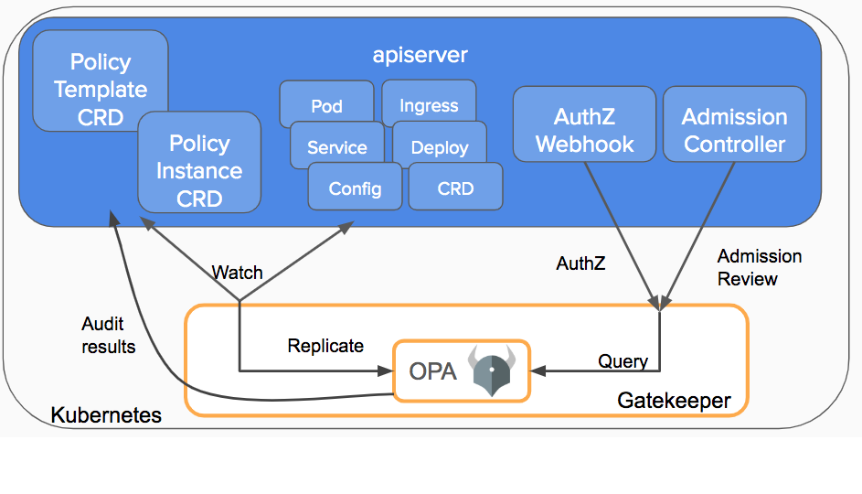

# Chap 9. Using OPA in Kubernetes

## Contents
- OPA Gatekeeper Overview
- Constraints Templates and Constraints for OPA gatekeeper
- Gatekeeper Policy Library
- Other Tools available in the Kubernetes
 
OPA provides an OPA gatekeeper for policy management of Kubernetes itself in a Kubernetes environment. Chapter 7 has already looked at how to operate the OPA server in a Kubernetes environment, but what we looked at earlier is not for Kubernetes' policy management, but for application policy management.
 
OPA has explained that it is useful for authorization and policy management for microservice environments and cloud-native environments (which can be regarded as a Kubernetes  environment). This chapter describes OPA gatekeepers that enable OPA to be used for managing Kubernetes policies required in CI/CD pipelines and DevOps environments.
 
## OPA Gatekeeper 
### OPA Gatekeeper Overview
The OPA gatekeeper serves as the final gateway to auditing whether Kubernetes API requests comply with policies defined by OPA immediately before they are reflected in the actual system after completing Kubernetes self-certification and authorization. As shown in Figure 9-1, the OPA gatekeeper implements Kubernetes' admission webhook controller to intervene whenever changes to resources occur in Kubernetes.

 

Figure 9-1. Interaction between OPA gatekeeper and Kubernetes [^6]

[^6] (Source: https://kubernetes.io/blog/2019/08/06/opa-gatekeeper-policy-and-governance-for-kubernetes/)

The current version of the OPA gatekeeper was first developed as v3.x, and the 1.x version was used to write and reflect the Rego file as a configmap, but in v3.x, it was changed to a method using CRD (Custom Resource Definition). Policies used by OPA gatekeepers are implemented as CRDs that define custom resources (CRs), customized resource types other than basic resources such as services and distribution of Kubernetes. Kubernetes CR, defined by OPA, is a constraint template and a constraint instantiated by setting arguments in that template for reuse of policies. Constraint templates contain Rego policies, and constraint instances are created by substituting arguments in the constraint template, and multiple instances with arguments factors may be created from one template.

The OPA gatekeeper is a separate project from the OPA and has been implemented in the Go language. OPA's Github repository is https://github.com/open-policy-agent/opa and OPA gatekeeper's Github repository is https://github.com/open-policy-agent/gatekeeper, which is different from each other. Documents on the OPA gatekeeper can be referred to through https://open-policy-agent.github.io/gatekeeper/website/docs, a different web page from the OPA official document.
 
### Installation and Removal of OPA Gatekeeper
Cluster-admin permission is required to install the OPA gatekeeper. If you use Minikube or docker desktop on a PC, there is no problem because all permissions are basically allowed. If you do not have administrative permissions in the actual service environment, you should contact the administrator. This book assumes that readers use Minikube or docker desktops.
 
To install the OPA gatekeeper, you can execute the kubectl command as follows. The post-execution warning message tells you to use v1 because the version of some installed components is v1beta1, which will not be supported in the future, and if no other errors occur, there is no problem with the operation. If the Kubernetes version is too up-to-date, the range of operable Kubernetes versions will narrow, so it seems that the OPA gateway project itself is maintaining the previous version. The OPA gatekeeper version at the time of writing this book is 3.3, and if an error occurs when readers run, apply the latest version of the OPA gatekeeper. If you want to check the latest version, you can check https://github.com/open-policy-agent/gatekeeper/releases.

``` 
$ kubectl apply –f https://raw.githubusercontent.com/open-policy-agent/gatekeeper/release-3.3/deploy/gatekeeper.yaml
 
namespace/gatekeeper-system created
Warning: apiextensions.k8s.io/v1beta1 CustomResourceDefinition is deprecated in v1.16+, unavailable in v1.22+; use apiextensions.k8s.io/v1 CustomResourceDefinition
customresourcedefinition.apiextensions.k8s.io/configs.config.gatekeeper.sh created
customresourcedefinition.apiextensions.k8s.io/constraintpodstatuses.status.gatekeeper.sh created
customresourcedefinition.apiextensions.k8s.io/constrainttemplatepodstatuses.status.gatekeeper.sh created
customresourcedefinition.apiextensions.k8s.io/constrainttemplates.templates.gatekeeper.sh created
serviceaccount/gatekeeper-admin created
podsecuritypolicy.policy/gatekeeper-admin created
role.rbac.authorization.k8s.io/gatekeeper-manager-role created
clusterrole.rbac.authorization.k8s.io/gatekeeper-manager-role created
rolebinding.rbac.authorization.k8s.io/gatekeeper-manager-rolebinding created
clusterrolebinding.rbac.authorization.k8s.io/gatekeeper-manager-rolebinding created
secret/gatekeeper-webhook-server-cert created
service/gatekeeper-webhook-service created
deployment.apps/gatekeeper-audit created
deployment.apps/gatekeeper-controller-manager created
Warning: admissionregistration.k8s.io/v1beta1 ValidatingWebhookConfiguration is deprecated in v1.16+, unavailable in v1.22+; use admissionregistration.k8s.io/v1 ValidatingWebhookConfiguration
validatingwebhookconfiguration.admissionregistration.k8s.io/gatekeeper-validating-webhook-configuration created
```

Components of the OPA gatekeeper are installed in the gatekeeper-system namespace. By executing the following command, information such as installed services and pads can be viewed.

``` 
$ kubectl -n gatekeeper-system get all
NAME READY STATUS RESTARTS AGE
pod/gatekeeper-audit-54b5f86d57-npssm 1/1 Running 0 28s
pod/gatekeeper-controller-manager-5b96bd668-2c7bv 1/1 Running 0 27s
pod/gatekeeper-controller-manager-5b96bd668-d8q4g 1/1 Running 0 27s
pod/gatekeeper-controller-manager-5b96bd668-w2jgc 1/1 Running 0 28s
 
NAME TYPE CLUSTER-IP EXTERNAL-IP PORT(S) AGE
service/gatekeeper-webhook-service ClusterIP 10.102.226.174 <none> 443/TCP 28s
 
NAME READY UP-TO-DATE AVAILABLE AGE
deployment.apps/gatekeeper-audit 1/1 1 1 28s
deployment.apps/gatekeeper-controller-manager 3/3 3 3 28s
 
NAME DESIRED CURRENT READY AGE
replicaset.apps/gatekeeper-audit-54b5f86d57 1 1 1 28s
replicaset.apps/gatekeeper-controller-manager-5b96bd668 3 3 3 28s
```

If you want to delete the OPA gatekeeper from Kubernetes after the test, you can execute the following command.

```
$ kubectl delete -f https://raw.githubusercontent.com/open-policy-agent/gatekeeper/release-3.3/deploy/gatekeeper.yaml
```

### OPA Gatekeeper Constraint Template
First, let's look at an example of an OPA gatekeeper constraint template. The contents of the example presented in the OPA gatekeeper document (https://open-policy-agent.github.io/gatekeeper/website/docs/howto) are as follows.

``` 
apiVersion: templates.gatekeeper.sh/v1beta1
kind: ConstraintTemplate
metadata:
  name: k8srequiredlabels
spec:
  crd:
    spec:
      names:
        kind: K8sRequiredLabels
      validation:
        # Schema for the `parameters` field
        openAPIV3Schema:
          properties:
            labels:
              type: array
              items: string
targets:
  - target: admission.k8s.gatekeeper.sh
    rego: |
      package k8srequiredlabels
 
      violation[{"msg": msg, "details": {"missing_labels": missing}}] {
        provided := {label | input.review.object.metadata.labels[label]}
        required := {label | label := input.parameters.labels[_]}
        missing := required - provided
        count(missing) > 0
        msg := sprintf("you must provide labels: %v", [missing])
      }
``` 
[^7]

[^7] # Source: https://raw.githubusercontent.com/open-policy-agent/gatekeeper/master/demo/basic/templates/k8srequiredlabels_template.yaml
 
The contents are as follows. First of all, the API type of the constraint template object is templates.gatekeeper.sh/v1beta1. If you use the current version of the gatekeeper, you can use this value, and if the version goes up in the future, it can be templates.gatekeeper.sh/v1, and so on.

Then, the name field in the metadata section defines the name of the constraint template. The spec section defines the specification of CRD, and the type of resource (Kind) defined by this CRD is K8sRequiredLabels, that is, the object for this resource is K8sRequiredLabels. And this resource has an attribute named labels, and the data type of the attribute is a string array.

For more information on CRD definitions, visit the official document of Kubernetes at https://kubernetes.io/docs/tasks/extend-kubernetes/custom-resources/custom-resource-definitions/.
 
In the last targets section, an array of objects with a target field and a rego field may come, and currently one object is used and the target is admission.k8s.gatekeeper.sh. If a function is added to the gatekeeper, another target type may be added. The rego field contains a policy written in the rego language of OPA.

The policy written in Rego is as follows. First of all, the package is designated the same as metadata.name, and one partial rule named violation is defined. The name of the package and partial rule must follow these rules and at least one violation rule must exist. Looking at blogs and examples on the Internet, the name of the partial rule is often named deny, which is the name used in the previous version of the OPA gatekeeper, so you can change it to violation and apply it.

The vibration partial rule creates an object with msg and detail fields containing error messages for rule violations. If no rule violation was found, the vibration partial rules would produce no results, so the result of the rule evaluation would be an empty set. If there is a matching rule among the vibration partial rules and an error object is generated, the content of the object is recorded in the audit section, and the Kubernetes API request is not reflected and the error returns.
 
Looking at the implementation of violation, first of all, while traversing the metadata.label item of the Kubernetes API object referred to as input.review.object.metadata.labels, the key of the label is named label, and collected as a set named provided using the set comprehension.

After that, a required set is created with the labels attribute handed over to input.parameters.labels. Then, we obtain the difference set between requested and supplied to create a missing set. This makes up a missing set of labels that are not included in the Kubernetes API calling object among the labels that have been handed over as arguments in the policy. Next, we compare whether the number of components in the missing set is greater than zero. If it is greater than 0, an error message is generated as a sprintf built-in function and assigned from the msg variable. Finally, with the values of msg and missing variables, an object {"msg": msg", details": {"missing_labels": missing}} is created.

To generate a constraint template, enter the following command.

```
$ kubectl apply -f https://raw.githubusercontent.com/open-policy-agent/gatekeeper/master/demo/basic/templates/k8srequiredlabels_template.yaml
```

### OPA Gatekeeper Constraint
This time, let's look at an example of the constraints presented in the OPA Gatekeeper document. The contents of the example are as follows.

``` 
apiVersion: constraints.gatekeeper.sh/v1beta1
kind: K8sRequiredLabels
metadata:
  name: ns-must-have-gk
spec:
  match:
    kinds:
      - apiGroups: [""]
        kinds: ["Namespace"]
  parameters:
    labels: ["gatekeeper"]
``` 
[^8] 

[^8] #Source: https://raw.githubusercontent.com/open-policy-agent/gatekeeper/master/demo/basic/constraints/all_ns_must_have_gatekeeper.yaml
 
First of all, the API type of the constraint template object is constraints.gatekeeper.sh/v1beta1. It may be seen that the value of the kind field is the same as that declared in the crd section of the previously declared constraint template. The name field in the metadata section declares the name of the constraint itself. 

The match part of the spec section specifies the target to which this constraint applies, in which example only works when Kubernetes manipulates the namespace. The match part specifies the target to which the constraint is to be selected.

The conditions that may be located below match are Kinds specifying a list of Kubernetes API objects, scope limiting the range, namespace range such as full range (*), namespaces specifying the included namespaces, expanded namespaces specifying the Kubernetes label selector. When multiple conditions are specified, everyone must be satisfied.

To explain the most commonly used Kinds matching, kinds is an array of objects with kinds and apiGroups fields as sub-elements, and is matched if only one of the array objects matches. Kinds can be Namespace, Pod, Ingress, etc., and apiGroups do not exist in Pod, Namespace and Ingress can have several apiGroups. The list of apiGroups according to the object can be checked by executing the kubectl api-resources command.

In the parameters part of the spec section, attributes declared in the template were specified as a string array with one element, "gatekeeper", as declared in the constraint template. Examining the overall content, it can be expected that a constraint named ns-must-have-gk will reject creation if the label gatekeeper does not exist when a namespace is created in Kubernetes.
 
Let's deploy this constraint to the next command.

```
$ kubectl apply –f https://raw.githubusercontent.com/open-policy-agent/gatekeeper/master/demo/basic/constraints/all_ns_must_have_gatekeeper.yaml
```

### Check OPA Gatekeeper Working
If both the constraint template and the constraint have been deployed, let's test to see if the constraint works as expected. First, let's create a namespace that satisfies the constraints. Save the following contents as good_ns1.yaml.

``` 
kind: Namespace
apiVersion: v1
metadata:
  name: goodns1
labels:
  gatekeeper: gatekeeper1
```

When goodns1.yaml is applied as the next command, the goodns1 namespace is successfully created because it satisfies the constraints.

```
$ kubectl apply -f goodns1.yaml
namespace/goodns1 created
```

And let’s test another namespace goodns2 which satisfies the constraints.

```
kind: Namespace
apiVersion: v1
metadata:
  name: goodns2
labels:
  gatekeeper: gw2
  environment: production
```

Since the content of goodns2.yaml satisfies the constraints, the goodns2 namespace was also successfully created.

``` 
$ kubectl apply -f goodns2.yaml
namespace/goodns2 created
```

This time, let's test what happens if we violate the constraints. Write the following and save it as badns.yaml.

``` 
kind: Namespace
apiVersion: v1
metadata:
  name: badns
labels:
  environment: production
```

If you run the command to apply badns.yaml as follows, you can see an error message that it has been rejected by the admssion webhook "validation.gatekeeper.sh" because it does not satisfy the constraint ns-must-have-gk. In addition, it may be seen that a detailed message (detail field) for an error provided by the constraint template is also output.

``` 
$ kubectl apply -f badns.yaml
Error from server ([denied by ns-must-have-gk] you must provide labels: {"gatekeeper"}): error when creating "badns.yaml": admission webhook "validation.gatekeeper.sh" denied the request: [denied by ns-must-have-gk] you must provide labels: {"gatekeeper"}
```

If you check the namespaces existing in Kubernetes with the following command, goodns1 and goodns2 exist, but badns do not exist. It is operating as expected.

``` 
$ kubectl get namespace
NAME STATUS AGE
default Active 12d
gatekeeper-system Active 35h
goodns1 Active 1h
goodns2 Active 1h
kube-node-lease Active 12d
kube-public Active 12d
kube-system Active 12d
```

### CRD-related kubectl Commands for OPA Gatekeeper
Earlier, it was explained that the resources used in the OPA gatekeeper are implemented as CRD. To verify the resources registered by the gatekeeper, grep the contents including gatekeeper among the output results of the kubectl api-resources command.

``` 
$ kubectl api-resources |grep gatekeeper
configs config.gatekeeper.sh true Config
k8srequiredlabels constraints.gatekeeper.sh false K8sRequiredLabels
constraintpodstatuses status.gatekeeper.sh true ConstraintPodStatus
constrainttemplatepodstatuses status.gatekeeper.sh true ConstraintTemplatePodStatus
constrainttemplates templates.gatekeeper.sh false ConstraintTemplate
```

It can also be checked with the kubectl get crds command as follows, but if other CRDs have not been registered, only gatekeeper-related results can be viewed.

``` 
$ kubectl get crds
NAME CREATED AT
configs.config.gatekeeper.sh 2021-02-10T02:22:31Z
constraintpodstatuses.status.gatekeeper.sh 2021-02-10T02:22:31Z
constrainttemplatepodstatuses.status.gatekeeper.sh 2021-02-10T02:22:31Z
constrainttemplates.templates.gatekeeper.sh 2021-02-10T02:22:31Z
k8srequiredlabels.constraints.gatekeeper.sh 2021-02-10T13:51:58Z
```

Returning to the execution result of the kubectl api-resources command and continuing the description, it has columns such as Name, SHORTNAMES, APIGROUP NAMESPACED, and KIND, which were removed due to the grep command in the above. The shortcut name field is empty because the resources added by the OPA gatekeeper do not have a shortcut name. You can also see the API group ending at gatekeeper.sh. Finally, it can be seen that the costraints template is also registered as CRD.
 
If you execute the kubectl get or kubectl describe command using the value of the name field, you can inquire related information.

By executing the command as follows, you can see a list of constraints templates and constraints.

```
$ kubectl get constrainttemplates
NAME AGE
k8srequiredlabels 4h12m
 
$kubectl get constraints
NAME AGE
k8srequiredlabels.constraints.gatekeeper.sh/ns-must-have-gk 4h23m
```

If you execute the kubectl get command using the name of the constraints template, you can see a list of constraints using the template.

``` 
$ kubectl get k8srequiredlabels
NAME AGE
ns-must-have-gk 3h23m
```

If you execute the command in the form of kubectl describe <CRD name of constraints template> <constraints> for constraints as follows, you can also see an audit log that records violations in the Status field.

``` 
$ kubectl describe k8srequiredlabels ns-must-have-gk
Name: ns-must-have-gk
Namespace:
Labels: <none>
Annotations: <none>
API Version: constraints.gatekeeper.sh/v1beta1
Kind: K8sRequiredLabels
... 
Status:
...
Total Violations: 5
  Violations:
    Enforcement Action: deny
    Kind: Namespace
    Message: you must provide labels: {"gatekeeper"}
    Name: default
    Enforcement Action: deny
    Kind: Namespace
    Message: you must provide labels: {"gatekeeper"}
    Name: gatekeeper-system
    Enforcement Action: deny
    Kind: Namespace
    Message: you must provide labels: {"gatekeeper"}
    Name: kube-node-lease
    Enforcement Action: deny
    Kind: Namespace
    Message: you must provide labels: {"gatekeeper"}
    Name: kube-public
    Enforcement Action: deny
    Kind: Namespace
    Message: you must provide labels: {"gatekeeper"}
    Name: kube-system
Events: <none>
```

If you look at the audit log, you can see that violation records remain for each namespace existing in the system. To resolve this part, the target namespace should be limited by processing the namespace out of the OPA gatekeeper or setting the namespace to be excluded from the constraints match section.
 
OPA provides a dry-run mode that verifies Kubernetes constraints, leaves only an audit log, and does not fail to reflect Kubernetes.  In order to set a dry run, enforcementAction: dryrun can be added to the spec section of the constraint. Let's add enforcementAction: dryrun to the file containing the ns-must-have-gk constraints we wrote earlier and save them as all_ns_must_have_gatekeeper_dryrun.yaml.

```
apiVersion: constraints.gatekeeper.sh/v1beta1
kind: K8sRequiredLabels
metadata:
  name: ns-must-have-gk
spec:
  enforcementAction: dryrun
  match:
    kinds:
      - apiGroups: [""]
        kinds: ["Namespace"]
  parameters:
    labels: ["gatekeeper"]
```

When the file is applied, the existing constraints will operate in dry-run mode because the constraints have not been renamed.

```
$ kubectl apply -f all_ns_must_have_gatekeeper_dryrun.yaml
k8srequiredlabels.constraints.gatekeeper.sh/ns-must-have-gk configured
```

Then, by applying badns.yaml, which previously failed with the command, you can see that the badns namespace has been created.

``` 
$ kubectl apply –f badns.yaml
namespace/badns created
```

As expected, it can be seen that badns were generated. If you check the audit log with the following command, you can see that the log remains in the audit log section. And it can be seen that when the audit log's Enforcement Action was not a dry run, it was deny but changed to a dry run.

``` 
$ kubectl describe k8srequiredlabels ns-must-have-gk
Name: ns-must-have-gk
Namespace:
Labels: <none>
Annotations: <none>
API Version: constraints.gatekeeper.sh/v1beta1
Kind: K8sRequiredLabels
...
Status:
...
  Violations:
    Enforcement Action: dryrun
    Kind: Namespace
    Message: you must provide labels: {"gatekeeper"}
    Name: default
    Enforcement Action: dryrun
    Kind: Namespace
    Message: you must provide labels: {"gatekeeper"}
    Name: gatekeeper-system
    Enforcement Action: dryrun
    Kind: Namespace
    Message: you must provide labels: {"gatekeeper"}
    Name: kube-node-lease
    Enforcement Action: dryrun
    Kind: Namespace
    Message: you must provide labels: {"gatekeeper"}
    Name: kube-public
    Enforcement Action: dryrun
    Kind: Namespace
    Message: you must provide labels: {"gatekeeper"}
    Name: kube-system
Events: <none>
```

## OPA Gatekeeper Policy Library
Policy libraries available for the OPA gatekeeper are provided through https://github.com/open-policy-agent/gatekeeper-library. First, let's replicate the Git repository as follows.

``` 
$ git clone https://github.com/open-policy-agent/gatekeeper-library
```

If you look at the downloaded content, there are three directories: src, test, and library, and src and test are directories containing sources and unit tests, respectively. Therefore, the policy to be used by the OPA gatekeeper must be found in the library directory.

```
$ ls
LICENSE Makefile NOTICE README.md library src test test.sh
```

Under the library directory, two subdirectories, general and pod-security-policy, are shown. You can also see kustomization.yaml, which is a file used for the purpose of collecting the entire template and creating it into one YAML, and does not need to be considered when using templates individually.

```
$ cd library
$ ls
general kustomization.yaml pod-security-policy
```

### General Template
Table 9-1 shows a list of general templates provided by the current version of the OPA Gatekeeper Library (as of February 2021).

| Template                | Description                                                                         |
| ----------------------  | ----------------------------------------------------------------------------------- |
| allowedrepos            | Allow only a specific image repository                                              |
| block-nodeport-services | Block service creation with NodePort                                                |
| containerlimits         | Limit the CPU and memory usage of the container                                     |
| containerresourceratios | Limit the ratio of the container's CPU, memory limit, and initial request value     |
| disallowedtags          | Prohibited from having a specific tag in the container image                        |
| externalip              | Restricts IPs other than allowed external IPs from being set in spec.externalIPs items of the service |
| httpsonly               | Do not allow HTTP to ingress and allow HTTPS only                                   |
| imagedigests            | Forcing the container image to include the digest                                   |
| requiredlabels          | Force to include specific labels                                                    |
| requiredprobes          | Force a specified list of probes among liveness probes, readiness probes, and startup probes to be set |
| uniqueingresshost       | Force new ingress not to use the same host of existing ingress                      |
| uniqueserviceselector   | Force the service to have the unique selector in the namespace                      |

Table 9-1. PSP templates provided by the OPA gatekeeper library.
 
First, let's find one of the templates in the general directory and look at the contents. Let's go to the imagedigest directory with the next command and then look at the directory structure with the tree command. Since the tree command is used only to examine the directory structure, it is not necessary to install it unless it is installed in the reader's environment.

```
$ cd general/imagedigest
$ tree
.
├── kustomization.yaml
├── samples
│   └── container-image-must-have-digest
│   ├── constraint.yaml
│   ├── example_allowed.yaml
│   └── example_disallowed.yaml
└── template.yaml
 
2 directories, 5 files
```

You can see the template.yaml file at the top, which is a constraint template file. There is a sample directory below and a directory called container-image-must-have-digest. In this directory, there are constraint.yaml files that instantiate the constraint template to define the constraint, and sample_allowed.yaml files containing examples of permitted and rejected cases, respectively.  Other libraries have the same structure, but the difference is that depending on the name and library of the directory containing the example below the samples, there is only an example_disallowed.yaml file without an example_allowed.yaml. Among the libraries, required labels contain almost the same content as the label example discussed earlier in Chapter 9, and the directory structure is as follows.

``` 
$ cd ../requiredlabels
$ tree
.
├── kustomization.yaml
├── samples
│   └── all-must-have-owner
│   ├── constraint.yaml
│   └── example_disallowed.yaml
└── template.yaml

```
Return to the imagedigests directory and look at the contents of the template.yaml file as follows.

``` 
apiVersion: templates.gatekeeper.sh/v1beta1
kind: ConstraintTemplate
metadata:
  name: k8simagedigests
  annotations:
    description: Requires container images to contain a digest.
spec:
  crd:
    spec:
      names:
        kind: K8sImageDigests
  targets:
    - target: admission.k8s.gatekeeper.sh
      rego: |
        package k8simagedigests
 
        violation[{"msg": msg}] {
          container := input.review.object.spec.containers[_]
          satisfied := [re_match("@[a-z0-9]+([+._-][a-z0-9]+)*:[a-zA-Z0-9=_-]+", container.image)]
          not all(satisfied)
          msg := sprintf("container <%v> uses an image without a digest <%v>", [container.name, container.image])
        }
 
      violation[{"msg": msg}] {
        container := input.review.object.spec.initContainers[_]
        satisfied := [re_match("@[a-z0-9]+([+._-][a-z0-9]+)*:[a-zA-Z0-9=_-]+", container.image)]
        not all(satisfied)
        msg := sprintf("initContainer <%v> uses an image without a digest <%v>", [container.name, container.image])
      }
```

The contents are as follows. Two violation partial rules are defined, and regular expression matching is performed by taking the spec.containers and spec.initContainers parts of the Kubernetes object that have passed over, respectively. It is difficult to understand the pattern matching in the regular expression only by looking at the constraints, but it will be easy to understand by looking at the example to be explained soon. If the part is not matched, an error message is generated, assigned to msg, and an object with a msg field is generated in the partial rule.
 
This time, let's look at constrain.yaml containing constraints.

``` 
apiVersion: constraints.gatekeeper.sh/v1beta1
kind: K8sImageDigests
metadata:
  name: container-image-must-have-digest
spec:
  match:
    kinds:
      - apiGroups: [""]
         kinds: ["Pod"]
    namespaces:
      - "default"
```

First of all, the kind was declared K8sImageDigests as defined in the constraint template, and the name of the constraint is container-image-must-have-digest. Since the attribute is not defined in the constraint template, there is no attribute set in the constraint. Looking at the spec.match section, you can see that this constraint applies to the pod and only works for the "default" namespace that is applied when the namespace is not selected in Kubernetes.
 
This time, let's look at the contents of sample_allowed.yaml.

```
apiVersion: v1
kind: Pod
metadata:
  name: opa-allowed
spec:
  containers:
    - name: opa
      image: openpolicyagent/opa:0.9.2@sha256:04ff8fce2afd1a3bc26260348e5b290e8d945b1fad4b4c16d22834c2f3a1814a
      args:
        - "run"
        - "--server"
        - "--addr=localhost:8080"
```

It is a common pod declaration, and it can be seen that the image field is added in the form of @<digest algorithm>:<digest value> to the next part of the image name. Applying this example will be acceptable because the constraint template allows the container image to contain the digest portion, and the constraint extends the template to be applied to the pod of the default namespace. If the namespace is "default", it will be allowed because it satisfies the deployed constraints, and if it is another namespace, it will be allowed because it is not subject to constraint matching.
 
Now let's look at the content of example_disallowed.yaml.

``` 
apiVersion: v1
kind: Pod
metadata:
  name: opa-disallowed
spec:
  containers:
    - name: opa
      image: openpolicyagent/opa:0.9.2
      args:
        - "run"
        - "--server"
        - "--addr=localhost:8080"
```

Except for the fact that the pod has a different name and no image digest, other parts are the same as sample_allowed.yaml. Since there is no image digest, an error will occur if you try to apply it to the default namespace.
 
Let's see if it works as we thought. In the imagedigests directory, run the following command to apply constraints templates and constraints.

``` 
$ kubectl apply -f template.yaml
constrainttemplate.templates.gatekeeper.sh/k8simagedigests created
$ kubectl apply -f samples/container-image-must-have-digest/constraint.yaml
k8simagedigests.constraints.gatekeeper.sh/container-image-must-have-digest created
```

This time, let's apply example_allowed.yaml. After applying it as a kubectl application, you can see that a container is created by checking it with the kubectl get pod command.

```
$ kubectl apply -f samples/container-image-must-have-digest/example_allowed.yaml
pod/opa-allowed created
$ kubectl get pod
NAME READY STATUS RESTARTS AGE
opa-allowed 0/1 ContainerCreating 0 6s
```

Next, let's apply example_disallowed.yaml. You can see that it has failed as expected.

```
$ kubectl apply -f samples/container-image-must-have-digest/example_disallowed.yaml
Error from server ([denied by container-image-must-have-digest] container <opa> uses an image without a digest <openpolicyagent/opa:0.9.2>): error when creating "samples/container-image-must-have-digest/example_disallowed.yaml": admission webhook "validation.gatekeeper.sh" denied the request: [denied by container-image-must-have-digest] container <opa> uses an image without a digest <openpolicyagent/opa:0.9.2>
```

This time, let's see if we apply sample_disallowed.yaml to nondefault namespaces, pod is created as expected. As shown in the following command, it was confirmed that the container was created by applying it to the goodns1 namespace created at the beginning of Chapter 9 with the –n option in kubectl. After that, the pod was deleted using the kubectl delete.

```
$ kubectl apply -n goodns1 -f samples/container-image-must-have-digest/example_disallowed.yaml
pod/opa-disallowed created

$ kubectl get pod -n goodns1
NAME READY STATUS RESTARTS AGE
opa-disallowed 1/1 Running 0 17s

$ kubectl delete pod opa-disallowed -n goodns1
pod "opa-disallowed" deleted
```

### PSP Template
If the general directory is a common template available on the OPA gateway, the pod-security-policy contains templates related to the pod security policy (PSP), a resource related to container security of the pod. For more information on PSP, visit the official document of Kubernetes (https://kubernetes.io/ko/docs/concepts/policy/pod-security-policy/).
 
Table 9-2 shows a list of PSP templates provided by the current version of the OPA Gatekeeper Library (as of February 2021).

| Control Aspect                    | Field Names in PSP          | Gatekeeper Constraint and Constraint Template |
| --------------------------------- | --------------------------- | --------------------------------------------- |
| Running of privileged containers  | privileged | privileged-containers |
| Usage of host namespaces | hostPID, hostIPC | host-namespaces |
| Usage of host networking and ports | hostNetwork, hostPorts | host-network-ports |
| Usage of volume types | volumes | volumes |
| Usage of the host filesystem | allowedHostPaths | host-filesystem |
| White list of Flexvolume drivers | allowedFlexVolumes | flexvolume-drivers |
| Requiring the use of a read only root file system | readOnlyRootFilesystem | read-only-root-filesystem |
| The user and group IDs of the container | runAsUser, runAsGroup, supplementalGroups, fsgroup | users (not supported in Gatekeeper v3) |
| Restricting escalation to root privileges | allowPrivilegeEscalation, defaultAllowPrivilegeEscalation | allow-privilege-escalation |
| Linux capabilities | defaultAddCapabilities, requiredDropCapabilities, allowedCapabilities | capabilities |
| The SELinux context of the container | seLinux | seLinux |
| The Allowed Proc Mount types for the container | allowedProcMountTypes | proc-mount |
| The AppArmor profile used by containers | annotations | apparmor |
| The seccomp profile used by containers | annotations | seccomp |
| The sysctl profile used by containers | forbiddenSysctls,allowedUnsafeSysctls | forbidden-sysctls |

[^9]

[^9] Source: https://github.com/open-policy-agent/gatekeeper-library/tree/master/library/pod-security-policy
Table 9-2. PSP templates provided by the OPA gatekeeper policy library

The PSP template is not significantly different from the general template, so a description thereof will be omitted.
 
## Configuration of OPA Gatekeeper
### Data Replication Settings
Looking at the gatekeeper policy libraries, in addition to the Kubernetes API calling object itself, there are libraries that can only work by examining other objects deployed to Kubernetes. For example, uniquingresshost among general libraries prevents the use of the same host as the existing ingress, but this requires that the host information of the existing ingress be available. This information is not shared by default in the OPA gatekeeper, but this information can be shared by setting the sync through the Configuration object.

The structure of the directory of library/general/uniqueingresshost in the policy library project is as follows.

```
$ ~/gatekeeper-library/library/general/uniqueingresshost$ tree .
.
├── kustomization.yaml
├── samples
│   └── unique-ingress-host
│   ├── constraint.yaml
│   ├── example_disallowed.yaml
│   └── example_disallowed2.yaml
├── sync.yaml
└── template.yaml
```

If you look at the contents, sync.yaml exists that was not found in other libraries. Sync.yaml contains a configuration object for this sync setting, and the contents are as follows. There is a sync setting in the lower part of the spec section. Uniqueresshost synchronizes the contents related to Ingress because it requires information from other Ingress. Looking at the result of the kubectl api-resources command, you can see that Ingress is registered in two API groups: extensions and networking.k8s.io, so there is an item for each.  The version field may specify a version supported by the installed Kubernetes for the corresponding object type (kind).

```
apiVersion: config.gatekeeper.sh/v1alpha1
kind: Config
metadata:
  name: config
  namespace: "gatekeeper-system"
spec:
  sync:
    syncOnly:
      - group: "extensions"
        version: "v1beta1"
        kind: "Ingress"
      - group: "networking.k8s.io"
        version: "v1beta1"
        kind: "Ingress"
```

Let's look at another example of data replication settings. The replication settings described in the OPA gatekeeper official document https://open-policy-agent.github.io/gatekeeper/website/docs/sync are as follows.

```
apiVersion: config.gatekeeper.sh/v1alpha1
kind: Config
metadata:
  name: config
  namespace: "gatekeeper-system"
spec:
  sync:
    syncOnly:
      - group: ""
        version: "v1"
        kind: "Namespace"
      - group: ""
        version: "v1"
        kind: "Pod"
```

Synchronization is set for the pod and namespace, and the group field is an empty string because the pod and namespace are objects with no particular API group.
 
Let's see how synchronized replication data is referenced when creating a policy from a constraint template to Rego. Opening template.yaml at the top of the uniqueresshost directory is as follows.

``` 
apiVersion: templates.gatekeeper.sh/v1beta1
kind: ConstraintTemplate
metadata:
  name: k8suniqueingresshost
  annotations:
    description: Requires all Ingress hosts to be unique.
spec:
  crd:
    spec:
      names:
        kind: K8sUniqueIngressHost
  targets:
    - target: admission.k8s.gatekeeper.sh
      rego: |
        package k8suniqueingresshost
 
        identical(obj, review) {
          obj.metadata.namespace == review.object.metadata.namespace
          obj.metadata.name == review.object.metadata.name
        }
 
        violation[{"msg": msg}] {
          input.review.kind.kind == "Ingress"
          re_match("^(extensions|networking.k8s.io)$", input.review.kind.group)
          host := input.review.object.spec.rules[_].host
          other := data.inventory.namespace[ns][otherapiversion]["Ingress"][name]
          re_match("^(extensions|networking.k8s.io)/.+$", otherapiversion)
          other.spec.rules[_].host == host
          not identical(other, input.review)
          msg := sprintf("ingress host conflicts with an existing ingress <%v>", [host])
        }
```

It can be seen that the constraint template refers to the  data.inventory.

Synchronized data is accessible through data.inventory, and cluster-scoped objects can be accessed in the form of data.inventory.cluster[<kind>][<name>], and namespace-scoped objects can be accessed through  data.inventory.namespace[<namespace>][groupVersion][<kind>][<name>].

Since ns, otherappiversoin, and name are not assigned variables in the data.inventory.names[ns][otherappiversion][name], so they are output variables. If the types of "Ingress" are found while traversing data.ineventory.names, ns, otherappiversion, and name variables are assigned  to the namespace, version, name of the found Ingress. And after matching the version with extensions/or networking.k8s.io/ with a regular expression, if the hosts are the same, check for the same object. If it has the same host even though it is not the same object, it generates an error message response object. In the Kubernetes environment, the exercise of uniqingresshost is left up to the readers. 
 
### Exempting Namespace
Exempting a particular namespace can help performance by preventing policies in the namespace that are not required by constraints from being evaluated. As for the exempting, the Configuration object can be modified and applied in the same way as the previous section of sync for data replication was set. After creating the expending_ns.yaml as follows, you can run kubectl apply –f exempting_ns.yaml.

```
apiVersion: config.gatekeeper.sh/v1alpha1
kind: Config
metadata:
  name: config
  namespace: "gatekeeper-system"
spec:
  match:
    - excludedNamespaces: ["kube-system", "gatekeeper-system"]
      processes: ["audit", "webhook", "sync"]
```

In this example, the kube-system namespace in which the Kubernetes system components are installed and the gatekeeper-system namespace in which the OPA gatekeeper components are installed were excluded. In addition, the exempting operation was designated as audit log, web hook, and data duplication, but if you simply designate processes: "*", you can perform an exemption for the entire operation.

Note that if the name of the existing configuration object and the metadata section are the same, it is recognized as the same configuration object, so the existing data synchronization setting can be removed by applying only the above content. Therefore, in order to maintain the existing setting, the match part of the spec section should be applied as the content added to the existing spec part.

The official OPA gatekeeper document explains one more way to process the namespace exemption, but it can only be applied to the audit log and requires complicated processes such as adding namespace to arguments when executing the OPA gatekeeper container in the pod. Interested readers, check out the contents of https://open-policy-agent.github.io/gatekeeper/website/docs/exempt-namespaces#exempting-namespaces-from-the-gatekeeper-admission-webhook-using---exempt-namespace-flag.

### Webhook Configuration
To set up the web hook of the OPA gatekeeper, you can find and modify the part of the YAML file you used for installation(https://raw.githubusercontent.com/open-policy-agent/gatekeeper/release-3.3/deploy/gatekeeper.yaml). Find the section that kind of it is Validating Webhook Configuration, and then apply it using the kubectl apply. The web hook part of the file is as follows.

What can be set up in the webhook is that the gatekeeper is set to operate only for CREATE and UPDATE as default values, and add DELETE is required if policies for verification of DELETE are needed to prevent user mistakes, add DELETE. Or changing the timeout value.

In addition, the part that requires attention in the webhook setting is the part set to Failure Policy: Ignore. The official document explains that in the event of a failure, it currently operates as an instance, so it was set to Ignore to reduce downtime and will be set to Fail when availability is secured in the future. However, in the state set to Ignore, a problem may occur because the request is executed when the webhook request fails. In the actual environment, it is better to change to Fail.

``` 
apiVersion: admissionregistration.k8s.io/v1beta1
kind: ValidatingWebhookConfiguration
metadata:
  creationTimestamp: null
  labels:
    gatekeeper.sh/system: "yes"
  name: gatekeeper-validating-webhook-configuration
webhooks:
- clientConfig:
    caBundle: Cg==
    service:
      name: gatekeeper-webhook-service
      namespace: gatekeeper-system
      path: /v1/admit
  failurePolicy: Ignore # Change it to Fail when applying it to the production
  name: validation.gatekeeper.sh
  namespaceSelector:
    matchExpressions:
    - key: admission.gatekeeper.sh/ignore
      operator: DoesNotExist
  rules:
  - apiGroups:
    - '*'
    apiVersions:
    - '*'
    operations: # To process DELETE, add -DELETE under -UPDATE
    - CREATE
    - UPDATE
    resources:
    - '*'
  sideEffects: None
  timeoutSeconds: 3
- clientConfig:
    caBundle: Cg==
    service:
      name: gatekeeper-webhook-service
      namespace: gatekeeper-system
      path: /v1/admitlabel
  failurePolicy: Fail
  name: check-ignore-label.gatekeeper.sh
  rules:
  - apiGroups:
    - ""
    apiVersions:
    - '*'
    operations:
    - CREATE
    - UPDATE
    resources:
    - namespaces
  sideEffects: None
  timeoutSeconds: 3
```

## Other Tools Available in the Kubernetes Environment
### Conftest
The OPA gatekeeper should be installed on the Kubernetes because it operates as an admission webhook of Kubernetes. In addition, the dryrun mode does not act as a normal dryrun that checks policies and does not apply them, but it acts as record policy violations and does not refuse to apply them. If so, is there any way to verify the format of the YAML file containing Kubernetis objects only with the contents of the YAML file when integrating them into the CI/CD pipeline? Of course, the use of OPA binaries, OPA policies created by themselves, and rego files included in the src directory of the policy library will make it easier to build such CI/CD pipelines.

Conftest is a tool that can be used more conveniently for this purpose. Just as Helm makes it easier to deploy Kubernetes applications, Connectest makes it possible to share various OPA policies related to Kubernetes. Conftest makes it easier to verify and manage not only Kubernetes but also various file formats used in cloud native environments such as docker and terraform.
 
The usage method introduced on the Conftest Github page is as follows. Compared with the opa test command for unit test, it can be seen that the test result is specialized in verifying the configuration file passed as arguments. The OPA rules used by Conftest can also generate error messages through vibrations partial rules similar to the OPA gatekeeper.

``` 
$ conftest test deployment.yaml
FAIL - deployment.yaml - Containers must not run as root
FAIL - deployment.yaml - Containers must provide app label for pod selectors
 
2 tests, 0 passed, 0 warnings, 2 failures, 0 exceptions
```

The Github repository of Conftest is https://github.com/open-policy-agent/conftest, and refer to https://www.conftest.dev for related documents.
 
### Use OPA with Terraform
Terraform is a tool that enables automation of infrastructure control for various cloud environments such as AWS, GCP, and Azure with code. If Terraform describes the shape of the desired infrastructure, it creates a change plan according to what needs to be changed in the current infrastructure state, and if the change plan is applied, changes will be applied to the actual infrastructure. The Terraform’s change plan is stored in its own binary format, but when converted into JSON, it can be verified beyond the JSON converted into OPA's input.

Let's take a simple example. The following is a simple terraform file that uses dockers as infrastructure to create nginx containers and expose them to 8080 ports. Let's create a temp directory and save the following to main.tf.

```
terraform {
  required_providers {
    docker = {
      source = "kreuzwerker/docker"
      version = "2.11.0"
    }
  }
}
 
provider "docker" {
}
 
resource "docker_container" "nginx" {
  image = "nginx:latest"
  name = "nginx_app"
  restart = "always"
  ports {
    internal = 80
    external = 8080
  }
}
```

Before executing the example, let's first check whether a docker is running or not by executing a docker ps command. And if you don't have a terraform installed, you can download, extract, and then add the directory location to the PATH environment variable. Since the terraform binary is a single executable file, there will be no significant difficulty in installing it
 
If the terraform installation is complete, the terraform is initialized by executing the following command in the directory where main.tf is located.

```
$ terraform init
 
Initializing the backend...
 
Initializing provider plugins...
- Finding kreuzwerker/docker versions matching "2.11.0"...
- Installing kreuzwerker/docker v2.11.0...
- Installed kreuzwerker/docker v2.11.0 (self-signed, key ID 24E54F214569A8A5)
 
... 
Terraform has been successfully initialized!
... 
```

By executing the following command, you can create a change plan file. Looking at the output, it is noted that the nginx container will be created as expected. It also indicates whether the value is set after executing the change plan.

``` 
$ terraform plan -out plan.binary
 
An execution plan has been generated and is shown below.
Resource actions are indicated with the following symbols:
+ create
 
Terraform will perform the following actions:
 
# docker_container.nginx will be created
+ resource "docker_container" "nginx" {
    + attach = false
    + bridge = (known after apply)
    + command = (known after apply)
    + container_logs = (known after apply)
    + entrypoint = (known after apply)
    + env = (known after apply)
    + exit_code = (known after apply)
    + gateway = (known after apply)
    + hostname = (known after apply)
    + id = (known after apply)
    + image = "nginx:latest"
    + init = (known after apply)
    + ip_address = (known after apply)
    + ip_prefix_length = (known after apply)
    + ipc_mode = (known after apply)
    + log_driver = "json-file"
    + logs = false
    + must_run = true
    + name = "nginx_app"
    + network_data = (known after apply)
    + read_only = false
    + remove_volumes = true
    + restart = "always"
    + rm = false
    + security_opts = (known after apply)
    + shm_size = (known after apply)
    + start = true
    + stdin_open = false
    + tty = false
 
    + healthcheck {
        + interval = (known after apply)
        + retries = (known after apply)
        + start_period = (known after apply)
        + test = (known after apply)
        + timeout = (known after apply)
    }
 
    + labels {
        + label = (known after apply)
        + value = (known after apply)
    }
 
    + ports {
        + external = 8080
        + internal = 80
        + ip = "0.0.0.0"
        + protocol = "tcp"
    }
}
 
Plan: 1 to add, 0 to change, 0 to destroy.
 
------------------------------------------------------------------------
 
This plan was saved to: plan.binary
 
To perform exactly these actions, run the following command to apply:
    terraform apply "plan.binary“
```

Since the stored "plan.binary" is a binary file, the content cannot be checked again by the editor. The terraform show command allows you to view the saved change plan file as text, and if you give the –json option as shown in the following command, set it’s output format to json. The output content was saved as plan.json as follows, and then the json files were sorted with high readability and stored again as pplan.json.

```
$ terraform show -json plan.binary > plan.json
$ python3 -m json.tool plan.json pplan.json
```

The contents of the stored pplan.json are as follows.

``` 
{
    "format_version": "0.1",
    "terraform_version": "0.14.8",
    "planned_values": {
        "root_module": {
            "resources": [
                {
                    "address": "docker_container.nginx",
... 
                        "ports": [
                            {
                                "external": 8080,
                                "internal": 80,
                                "ip": "0.0.0.0",
                                "protocol": "tcp"
                            }
                        ],
                        "privileged": null,
....
                    }
                }
            ]
        }
    },
    "resource_changes": [
...
    ],
    "configuration": {
... 
    }
}
```

Suppose that the nginx port is set to 8080, and the port exposed by the container should be greater than 10000 according to internal regulations. Let's write a simple OPA rule and check if the port is larger than 10000.

Write the following and save it as tftest.rego. The hierarchical structure of the JSON file is complicated, and the rules will be familiar.

``` 
package tftest
 
default allowed = false
 
allowed {
  input.planned_values.root_module.resources[_].values.ports[_].external > 10000
}
```

Once the save is complete, let's run tftest.rego and pplan.json with the opa eval command, and look up the results of the data.tftest.allow rule as follows.

```
$ opa eval --input pplan.json --data tftest.rego "data.tftest.allowed"
{
  "result": [
    {
      "expressions": [
        {
          "value": false,
          "text": "data.tftest.allowed",
          "location": {
            "row": 1,
            "col": 1
          }
        }
      ]
    }
  ]
}
```

As expected, false was printed. If you change the value of the port inspected by tftest.rego to 8000 and then execute it, true will be printed.

Readers who want more details should refer to https://www.openpolicyagent.org/docs/latest/terraform/ on the OPA official website.
 
### opa-kafka-plugin
Kafka can control access to message topics by implementing an authorization plug-in. The authorization plug-in only needs to implement the Authorizer Java interface, and for the contents of the Authorizer interface, see https://kafka.apache.org/24/javadoc/org/apache/kafka/server/authorizer/Authorizer.html.
 
To use OPA for kafka authorization, the implementation of the Autroizer interface can transfer the arguments of the authorization request to the OPA REST server as input and return the results to the result of the authorization request again. Of course, rules for authorization must be written and configured on the OPA server, and how to configure the OPA server has already been covered in Chapter 7. Since the result of determining the authorization request of the Authorizer interface is ALLOWED/DENIED, you can return the result to boolean in the OPA rule.
 
Referring to the [OPA official document](https://www.openpolicyagent.org/docs/latest/kafka-authorization/), it explains how to link OPA to Kafka. In the official document, a module called [kafka-authorizer](https://github.com/open-policy-agent/contrib/tree/master/kafka_authorizer), not [opa-kafka-plugin](https://github.com/Bisnode/opa-kafka-plugin), is used. The module is provided in a repository where OPA's user contribution codes are collected, and the version is not clearly managed.
 
Either is fine because it is a simple code that receives input from Kafka's Authorizer interface and delivers it to the OPA server, but opa-kafka-plugin is systematically managing the version, so it would be better to use opa-kafka-plugin.

The contents of the input transmitted through opa-kafka-plugin in Kafka are as follows.

```
{
  "operation": {
    "name": "Write"
  },
  "resource": {
    "resourceType": {
      "name": "Topic"
    },
    "name": "alice-topic1"
  },
  "session": {
    "principal": {
      "principalType": "alice-producer"
    },
    "clientAddress": "172.21.0.5",
    "sanitizedUser": "alice-producer"
  }
}
```
[^10]
[^10] Source: https://github.com/Bisnode/opa-kafka-plugin
 
You can make a rule to determine the corresponding JSON input and return true/false, and set the URL of the plug-in to call the rule from the OPA server.

For more information, please refer to https://github.com/Bisnode/opa-kafka-plugin.

### opa-envoy-plugin
Recently, more and more service meshes are applied together than only Kubernetes. The most representative and widely used service mesh is Istio. Istio had previously provided OPA integration through mixer components, but as mixer components were removed from the latest version, it was changed to a structure interlocked through the Envoy Authz filter. The Envoy Authz filter defines a gRPC protocol capable of linking authentication/authorization specifications for external authentication servers with the outside. Since almost all service mesh implementations use Envoy as a data plane, the method using the Envoy Authz filter can be easily applied to other service meshes.

It is too vast to explain the service mesh or Envoy itself, and the current Istio is changing at a rapid pace, so this book does not elaborate further. Interested readers should visit https://github.com/open-policy-agent/opa-envoy-plugin.
 
## Summary
Chapter 9 describes the outline and method of use of OPA gatekeepers that can be applied to Kubernetes' own policies and authority management, not user applications. It also explained how to create and apply constraints templates and constraints for OPA gatekeepers, and how to check audit logs. In addition, we looked at policy libraries available at OPA gatekeepers. Finally, in addition to the OPA gatekeeper, other tools applicable to the Kubernetes-based environment were briefly introduced.

Chapter 10 examines how to implement built-in functions and expand basic OPA functions.
